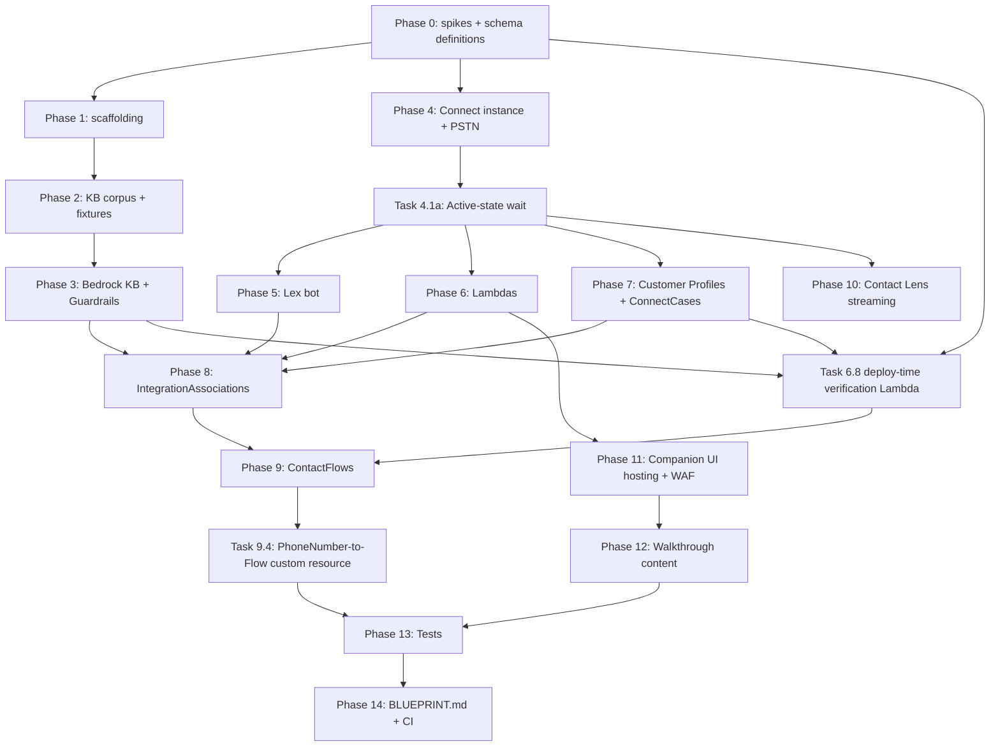

# Tech-Spec: AI Contact Centre (Council Reception)

**Created:** 2026-04-28

## Overview

### What you're building (200-word lede)

When a UK resident dials the council, they often describe three problems at once and they're upset. This scenario shows AWS handling that gracefully: opening **one** ticket that captures every intent, then connecting a later WhatsApp photo to the **same** case so the council never asks the resident to repeat themselves. The lease user dials a real UK +44 800 number provisioned in their own sandbox, plays a layered distress-and-multi-intent script (or speaks one live), and watches a companion UI render the live transcript with PII redacted, the Connect Case assembling field-by-field, and a separately-uploaded photo of an overflowing bin landing on the same ticket with a structured Bedrock multimodal description attached. The closing moment, the climax this scenario exists to demonstrate, is a Polly Neural en-GB voice saying **"I've reviewed your photo; environmental health will visit Wednesday, ref ABC123."** That one sentence is what a council CIO will remember and what a Director of Customer Services will photograph for their CIO. Everything else in the spec exists to deliver that sentence reliably and defensibly inside an ephemeral ISB lease.

### Problem Statement

NDX:Try has 12 ISB scenarios but no demonstration of voice or conversational AI on AWS. UK local-government contact centres are a high-impact use case (call volume, distressed callers, multi-intent situations, statutory equality duties) and the current scenario set does not show how Amazon Connect plus the AWS AI stack can serve a fictional council end-to-end.

### Solution

A self-serve, single-lease scenario deploying via NDX/SandboxAdmin into us-east-1. On lease assignment, fully provisions: Amazon Connect instance, claimed UK +44 800 toll-free number (claim-never-release; pool account closure handles cleanup), Lex v2 bot (en_GB), Bedrock KB with Guardrails, Bedrock multimodal model wired through Lambdas, **`AWS::ConnectCases::Domain`** + Field + Layout + Template, Customer Profiles domain wired to Connect via spike-validated mechanism, contact flows, Lambdas, Contact Lens with PII redaction enabled at the instance attribute level, Kinesis stream + SQS DLQ, DynamoDB cache (post-redaction PII only), CloudFront with AWS WAF + OAC, Lambda Function URL `AuthType: AWS_IAM`. Two demonstrable journeys:

1. **Distress + multi-intent triage (en_GB voice).** Caller dials the lease's number, describes a layered situation. A multi-intent decomposer Lambda calls Bedrock to extract every distinct intent (capped at 4 per turn). The contact flow processes each independently. Bedrock Guardrails block hallucinated legal advice. Contact Lens flags rising distress. Connect Cases opens a single ticket capturing all intents. Polly acknowledges every detected intent by name and reads back a reference number.

2. **Cross-channel single-case (voice plus webchat-as-WhatsApp).** Lease user opens a "WhatsApp simulator" panel that uploads images via direct browser-to-S3 presigned PUT (avoiding multipart-through-CloudFront constraints). Bedrock multimodal returns a structured description. The multimodal Lambda owns the cross-channel orchestration: it calls `cases:SearchCases` by phone, then `cases:UpdateCase` with ETag if-match (single retry on conflict), so concurrent submissions converge on one case. When the caller dials back, the bot leads with **"I've reviewed your photo; environmental health will visit Wednesday, ref ABC123."**

### Welsh language and accessibility

Welsh is *not* a real-time feature in this scenario `[F20]`. Investigation found three blocking gaps in first-party AWS as of 2026-04: Transcribe `cy-WL` is batch only, Lex v2 `cy_GB` is feature-limited, Polly Welsh is Standard engine only. Walkthrough Step 1 sets expectations early ("This demo is in English; we explore Welsh-language gaps in Step 7"); Step 7 is the takeaway artefact framed as **"What we'd need from AWS to make this Welsh-ready"** with a strategic ask block, ONS census data, and accessibility-beyond-Welsh content (TTY, Live Transcription, SMS reporting, BSL/video-relay forward note). AC11 asserts the page's structure rather than literal prose strings, so content updates do not break the test.

### Scope

**In Scope:**

- All deployable AWS resources listed in Solution
- Multi-intent decomposer Lambda with intent-cap of 4 per turn
- WhatsApp Lambda code exercised by both simulator AND a WABA payload fixture
- Cross-channel single-Case unification with conditional-write semantics — owned by the multimodal Lambda explicitly
- Companion UI: three-pane layout, step-driven dimming, staged simulator feedback, "Copy share text", share PDF
- Direct browser-to-S3 presigned PUT for image uploads
- Contact Lens native redaction at the Connect instance attribute level + small consumer-Lambda transform `[NAME]` → `{NAME}` for the documented placeholder format
- Phase 0 spikes including a Customer Profiles wiring spike (Task 0.6)
- Deploy-time verification Lambda + custom resource implementing AC18
- BLUEPRINT.md including pre-deploy `aws s3 sync`, Bedrock model access enablement, itemized cost expectations, **mandatory `isb close-account` after lease termination**, pre-delete safety checklist
- Spike outputs as structured checked-in files
- Step 2 distress audio with ethical-review credits + content warning + safeguarding sign-off (Task 2.9 + new Task 2.9a)
- AC traceability via inline `Implements: AC#` lines on each task

**Out of Scope:**

- Real WhatsApp Business Account registration
- Native real-time Welsh voice round-trip
- Polish (pl-PL) and other locales beyond en_GB
- Human agents, queues, routing profiles for live operators
- Voice ID / voice biometrics
- Outbound Connect Campaigns
- Integration with any real council back-office system
- Production hardening
- Stage-presentation framing
- Cost-comparison sidebar
- Multi-viewer companion link

## Context for Development

### Build dependency overview (Mermaid)



### Cross-channel single-Case data flow (Mermaid)

```mermaid
sequenceDiagram
    actor Caller
    actor SimUser as Simulator user
    participant Connect
    participant Lex
    participant MIL as Multi-intent Lambda
    participant RAGL as RAG fulfilment Lambda
    participant Cases as Connect Cases
    participant SPA as Companion SPA
    participant S3
    participant MML as Multimodal Lambda
    participant Bedrock

    Caller->>Connect: Dial PSTN
    Connect->>Lex: Recognize utterance
    Lex->>MIL: MultiIntentTriage / fallback
    MIL->>Bedrock: Decompose (cap 4)
    MIL-->>Connect: intents[]
    loop for each intent (max 4)
        Connect->>RAGL: Dispatch
        RAGL->>Bedrock: RetrieveAndGenerate (KB)
    end
    Connect->>Cases: SearchCases by phone
    alt found
        Connect->>Cases: UpdateCase (ETag if-match)
    else not found
        Connect->>Cases: CreateCase
    end
    Connect->>Caller: Polly readback (ref)

    Note over SimUser,SPA: later, in browser
    SimUser->>SPA: Attach photo + sender phone
    SPA->>MML: GET /api/upload-presign
    MML-->>SPA: presigned PUT URL
    SPA->>S3: PUT image (direct, bypasses CloudFront)
    SPA->>MML: POST /api/simulator/send (S3 key + phone)
    MML->>Bedrock: Multimodal describe (max 1 retry, ≤9s)
    MML->>Cases: SearchCases by phone
    alt found same case
        MML->>Cases: UpdateCase (ETag if-match) → on conflict, retry once
    else
        MML->>Cases: CreateCase + RelatedContactId
    end
    MML-->>SPA: Structured description bubble
    
    Note over Caller,Cases: Caller dials back
    Caller->>Connect: Dial PSTN (same phone)
    Connect->>Cases: SearchCases by phone → finds case with photo
    Connect->>Caller: Polly: "I've reviewed your photo; environmental health will visit Wednesday, ref ABC123."
```

### Codebase Patterns

The closest precedents:

- **`council-chatbot`** for the AI core (S3 Vectors, KB, ingestion-job custom resource, IAM-prefix patterns)
- **`paperless-ngx`** for the companion UI (CloudFront-fronted Lambda Function URL)
- **`aws-samples/contact-center-genai-agent`** (last push 2026-03-26) for the four-stack RAG agent shape
- **`aws-samples/sample-amazon-connect-bedrock-agent-voice-integration`** (last push 2025-11-18) for the real-PSTN Connect-claimed-number pattern
- **`aws-samples/sample-whatsapp-end-user-messaging-connect-chat`** (last push 2026-04-14) for WhatsApp media-handling Lambda code

Other patterns: inline-Lambda Python 3.12 with `urllib.request` cfnresponse helper; `--s3-bucket` for templates >51KB; documents pre-staged via `aws s3 sync` (NOT inline Lambda strings); Eleventy walkthrough templates under `src/walkthroughs/<scenario-id>/step-N.njk`.

### Files to Reference

| File | Purpose |
| ---- | ------- |
| `cloudformation/scenarios/council-chatbot/template.yaml` | KB + S3 Vectors + ingestion-job custom resource patterns |
| `cloudformation/scenarios/council-chatbot/BLUEPRINT.md` | BLUEPRINT format |
| `cloudformation/scenarios/council-chatbot/documents/` | KB seed-document layout |
| `cloudformation/scenarios/paperless-ngx/template.yaml` | CloudFront-fronted Lambda Function URL companion UI |
| `src/walkthroughs/paperless-ngx/step-4.njk` | Walkthrough page integrating companion UI URL |
| `src/_data/scenarios.yaml` | Scenario registry shape |
| `src/_data/walkthroughs.yaml` | Walkthrough registry shape |
| `cloudformation/scenarios/digital-planning-register/`, `cloudformation/scenarios/planx/` | Direct-CFN deployment precedents |

### Technical Decisions

- **Region:** us-east-1 only.
- **Deployment route:** direct CFN via NDX/SandboxAdmin.
- **Lifecycle posture:** pure-lease ephemeral.
- **PSTN strategy:** per-lease claim, never call `ReleasePhoneNumber`. `DeletionPolicy: Retain`. **Pool-account closure mandated by BLUEPRINT.md** (not just `isb terminate`; explicit `isb close-account` afterward) `[F-cap-mitigation]`.
- **Welsh strategy:** out of scope as real-time; Step 7 is the procurement-leverage takeaway, AC11 has structural assertions `[F20]`.
- **WhatsApp strategy:** webchat simulator routes to the same Lambda a real WABA event destination invokes via `social-messaging:PutWhatsAppBusinessAccountEventDestinations` `[F10]`; both paths tested.
- **Bedrock model selection:** `amazon.titan-embed-text-v2:0` for embeddings, `amazon.nova-pro-v1:0` for generation, multimodal photo describe, AND multi-intent decomposition. Phase 0.5 spike + BLUEPRINT.md prerequisite + AC18 deploy-time check `[F5]`.
- **Lex v2 build:** native CFN with `AutoBuildBotLocales: true`.
- **Multi-intent strategy:** Bedrock-powered decomposer Lambda. **Cap at 4 intents per turn** `[F16]`; beyond that, the contact flow plays "I've heard several issues; let me focus on the top four first" and queues the rest.
- **Bedrock KB:** S3 Vectors. Documents pre-staged via `aws s3 sync` `[F18]`.
- **Customer Profiles wiring:** Phase 0.6 spike validates the precise wiring mechanism (likely `customer-profiles:PutIntegration` from CustomerProfiles side OR an `AWS::Connect::InstanceStorageConfig`). Task 7.1 `DependsOn: ConnectInstanceActiveWait` (so the domain creates after Connect is up). AC18 verifies binding via `connect:ListIntegrationAssociations` AND a profile read from the Connect instance Lambda role `[F4-tightened]`.
- **Connect IntegrationAssociation ordering:** explicit `[F-architectural]`. (1) Connect instance reaches `ACTIVE` (Task 4.1a polls `DescribeInstance` every 10s, 5min timeout, FAILED on miss). (2) Lex bot/alias and Lambdas exist. (3) ConnectCases domain exists. (4) IntegrationAssociations for Lex (`LEX_BOT`), each Lambda (`LAMBDA_FUNCTION`), ConnectCases (`CASES_DOMAIN`). (5) ContactFlows reference everything via `Fn::Sub` and `DependsOn` all the IntegrationAssociations. (6) PhoneNumber-to-Flow via custom resource calling `connect:AssociatePhoneNumberContactFlow`.
- **PhoneNumber-to-Flow:** custom resource. Idempotent disassociation on Delete `[F15]`.
- **Multimodal Lambda owns cross-channel orchestration:** explicit numbered steps (see Task 6.2). Calls `cases:SearchCases` by phone → `cases:UpdateCase` with ETag if-match (1 retry on conflict) OR `cases:CreateCase`. AC10 + AC21 implementation lives here, not implicit `[Cross-channel-ownership-fix]`.
- **ContactFlow JSON:** kept in `contact-flows/main-flow.json`, loaded into CFN via `Fn::Sub`.
- **Templates >51KB:** uploaded via `--s3-bucket`.
- **Companion UI hosting:** static SPA in S3, CloudFront with **OAC** for both the S3 origin and the Lambda Function URL origin. **Image uploads from the browser go directly to S3 via presigned PUT URL** `[F6]`. The S3 bucket policy permits PutObject only via IAM SigV4 (the presigner role); OAC governs CloudFront → S3 reads only. The presigned URL contains `bucket DNS host` AND `region` natively (S3 SigV4 mechanics) so the SPA does not need separate bucket-name/region config. Function URL `AuthType: AWS_IAM`.
- **AWS WAF:** CloudFront distribution carries an `AWS::WAFv2::WebACL` with `AWSManagedRulesCommonRuleSet` + a rate-based rule (1000 requests / 5 min / IP, action: block) `[F9]`. Test 13.14 asserts the **WebACL configuration** (managed rule presence, rate threshold), NOT load-driven exercise of the rule `[F-CI-clarification]`.
- **CORS pinning:** S3 bucket CORS rules limit allowed-origins to the deployed CloudFront distribution domain only. No wildcards `[F9]`.
- **Contact Lens redaction at instance attribute level:** Connect instance configured with `Attributes.Redaction: { Enabled: true, Types: [PII], Output: REDACTED_AND_ORIGINAL }`. Contact Lens emits `RedactedSegment` and `OriginalSegment`; the consumer Lambda **reads only `RedactedSegment` and writes only that** to DynamoDB `[F8]`. Contact Lens uses `[NAME_1]`-style placeholders; the consumer Lambda transforms these to the documented `{NAME}` format. AC7 asserts the `{NAME}` format; AC19 asserts no raw PII residue anywhere at rest.
- **Stream consumer error handling:** `MaximumRetryAttempts: 2`, `BisectBatchOnFunctionError: true`, SQS DLQ, CloudWatch alarm on DLQ depth >0 `[F17]`. With `BatchingWindow: 1` (one second), batches are typically size-1; bisect on size-1 immediately routes to DLQ — that's correct. Alarm threshold is 3 records in 5 minutes (avoids fire on transient single failures).
- **Contact Lens streaming:** Kinesis with `BatchingWindow: 1` (one second; minimum reliable) `[F11]`.
- **Multimodal retries:** at most one validation retry. Total budget per call ≤9s `[F7]`.
- **Concurrent simulator submission:** ETag if-match on `cases:UpdateCase`. On conflict, retry once after re-fetching `[F12]`.
- **Spike outputs:** Tasks 0.0–0.6 each write a structured checked-in file. Spike file staleness check (`measurement_date` < 90 days at CI start) warns if data is stale `[F18-tightened]`.

### Inline schema for multimodal output (avoids tab-bouncing during Task 6.2 implementation)

```json
{
  "$schema": "https://json-schema.org/draft/2020-12/schema",
  "title": "MultimodalImageDescription",
  "type": "object",
  "required": ["object_class", "condition", "severity", "suggested_council_action", "confidence"],
  "additionalProperties": false,
  "properties": {
    "object_class": {
      "type": "string",
      "enum": ["bin", "fly_tip", "damp", "parked_vehicle", "broken_paving", "missed_collection", "other"]
    },
    "condition": { "type": "string", "minLength": 1, "maxLength": 200 },
    "severity": { "type": "string", "enum": ["low", "medium", "high", "urgent"] },
    "suggested_council_action": { "type": "string", "minLength": 1, "maxLength": 300 },
    "confidence": { "type": "number", "minimum": 0, "maximum": 1 },
    "secondary_observations": { "type": "array", "items": { "type": "string" } }
  }
}
```

## Implementation Plan

### Tasks

#### Phase 0 — De-risk spikes and schema definitions (do FIRST)

- [ ] **Task 0.0: Define output schemas** (was Tasks 2.7 + 2.8 — moved to Phase 0 so Tasks 0.3 onward can validate against them) `[F-Task-0.3-unimplementable]`
  - File: `schemas/multimodal-output.schema.json` and `schemas/multi-intent-output.schema.json`
  - Action: write both JSON schemas with frozen field types and enums. The multimodal schema is reproduced inline above. Multi-intent schema: array of `{intent_name, slots, confidence, verbatim_excerpt}` plus top-level `requires_safeguarding_review: bool`. Minimum array length 1.
  - Implements: prerequisites for AC9, AC3, AC19, AC21.

- [ ] **Task 0.1: Spike per-lease +44 800 PSTN claim repeatability AND TargetArn association** `[F19]`
  - As before. **Output also structured:** `spikes/pstn-claim-results.json` with `{ attempts, successes, failure_reasons[], measurement_date }` `[F18-Task-0.1-structured]`.
  - Implements: AC1 (deploy budget), AC2 (PSTN hero), AC13 (teardown).

- [ ] **Task 0.2: Spike Connect Cases under SandboxAdmin** `[F1]`
  - As before. **Output structured:** `spikes/cases-domain-results.json` with `{ resource_types_verified[], iam_blocks_observed[], measurement_date }` `[F18-Task-0.2-structured]`.
  - Implements: prerequisite for AC10, AC21.

- [ ] **Task 0.3: Spike Bedrock multimodal output quality and harden the prompt template**
  - As before. Validates against `schemas/multimodal-output.schema.json` from Task 0.0. Output: `spikes/multimodal-prompt-template.md` (the prompt) + `spikes/multimodal-results.json` (the test results, structured).
  - Implements: prerequisite for Task 6.2, AC9.

- [ ] **Task 0.4: Spike Contact Lens end-to-end latency**
  - Output: `spikes/contact-lens-latency.json` with `{ p50_ms, p95_ms, p99_ms, sample_size, measurement_date }`.
  - Implements: AC8a, AC8b numerics.

- [ ] **Task 0.5: Spike Bedrock model access enablement** `[F5]`
  - Output: `spikes/bedrock-model-access.md`.
  - Implements: prerequisite for AC18.

- [ ] **Task 0.6: Spike Customer Profiles wiring to Connect instance** `[F4-tightened]`
  - Action: deploy a minimal stack with `AWS::Connect::Instance` + `AWS::CustomerProfiles::Domain` in same region/account. Verify the binding mechanism: try (a) automatic discovery on instance creation, (b) `customer-profiles:PutIntegration` with the Connect instance ARN as URI, (c) `AWS::Connect::InstanceStorageConfig` with `ResourceType: CONTACT_TRACE_RECORDS` and Customer Profiles attributes. After each attempt, call `connect:ListIntegrationAssociations` and verify a Customer Profiles entry. Document which mechanism actually works as the binding source of truth.
  - Output: `spikes/customer-profiles-wiring.md` with the verified mechanism.
  - Implements: prerequisite for AC18, Task 7.1.

#### Phase 1 — Scaffolding (PR 1)

- [ ] **Task 1.1: Create scenario directory layout** (incl. `schemas/`, `audio/`, `spikes/`)
  - Implements: prerequisite for all subsequent.
- [ ] **Task 1.2: Bootstrap CFN template skeleton**
  - Implements: AC1.
- [ ] **Task 1.3: Add scenario entry to `src/_data/scenarios.yaml`**
  - Implements: AC1, AC14.
- [ ] **Task 1.4: Add walkthrough entry to `src/_data/walkthroughs.yaml`**
  - Implements: AC14.
- [ ] **Task 1.5: Stub walkthrough Eleventy pages**
  - Implements: AC14.
- [ ] **Task 1.6: Add scenario to screenshot pipeline**
  - Implements: AC14.

#### Phase 2 — KB seed corpus + fixtures (PR 1)

- [ ] **Task 2.1: Author Markdown KB documents for Aldershire District Council services**
  - Implements: AC5, AC6.
- [ ] **Task 2.2: Author Lex utterance fixtures**
  - Implements: AC4.
- [ ] **Task 2.3: Author golden-answer fixtures for KB grounding**
  - Implements: AC5, AC6.
- [ ] **Task 2.4: Author Welsh + accessibility takeaway page content (procurement-leverage framing)** `[F-Welsh-framing]`
  - File: `documents/welsh-accessibility-takeaway.md`
  - Action: 700-1000 words. Title-frame as "What we'd need from AWS to make this Welsh-ready." Three-column table at top. ONS census 2021 data point with citation. **Strategic ask block: "If you're a UK gov body procuring contact-centre AI, the questions to put to your AWS Technical Account Manager are: (1) Welsh streaming Transcribe ETA, (2) Native cy_GB Lex NLU ETA, (3) Polly Neural Welsh ETA, (4) BSL via video relay roadmap."** Accessibility-beyond-Welsh section: TTY support, Live Transcription for hearing-impaired callers, SMS reporting alternatives, BSL/video-relay forward note. Signed-and-dated footer with the investigation date.
  - Implements: AC11.
- [ ] **Task 2.5: Author multi-intent fixtures** (incl. fixtures with 5+ intents to verify cap)
  - Implements: AC3.
- [ ] **Task 2.6: Author WABA payload fixture**
  - Implements: AC12.
- [ ] **Task 2.9: Record distress script audio**
  - Implements: AC2.
- [ ] **Task 2.9a: Ethical review checkpoint for distress audio** `[F-Mary-distress-ethical]`
  - File: `audio/SCRIPT-ETHICAL-REVIEW.md`
  - Action: document the script's authorship, the safeguarding lead who reviewed it, the date of review, the content warning, and the playback policy ("this audio depicts a fictional distressed caller; not for use in any real safeguarding training without consultation with [team]"). Step 2 walkthrough renders the content warning AND attribution prominently before the download link.
  - Implements: AC11 (extends), AC2 (ethical readiness), AC22 (NEW — see ACs).

(Note: Tasks 2.7 and 2.8 from prior version moved to Phase 0.0.)

#### Phase 3 — Bedrock KB + Guardrails (PR 1)

- [ ] **Task 3.1: Add S3 Vectors bucket and index**
  - Implements: AC5.
- [ ] **Task 3.2: Add KB IAM role**
  - Implements: AC5, AC18.
- [ ] **Task 3.3: Add Bedrock KnowledgeBase + DataSource**
  - Implements: AC5.
- [ ] **Task 3.4: Implement seed-data Lambda + custom resource (S3-staged docs)** `[F-inline-ZipFile-fix]`
  - Implements: AC5, AC1 budget.
- [ ] **Task 3.5: Invoke seed-data custom resource**
  - Implements: AC5.
- [ ] **Task 3.6: Add Bedrock Guardrail**
  - Implements: AC6.

#### Phase 4 — Connect instance + PSTN (PR 2)

- [ ] **Task 4.1: Add Connect instance with Contact Lens redaction enabled at instance attribute level** `[F8-redaction-mechanism]`
  - File: `template.yaml`
  - Action: `AWS::Connect::Instance` with `Attributes` including `INBOUND_CALLS: true`, `OUTBOUND_CALLS: true`, `CONTACT_LENS: true`, `CONTACTFLOW_LOGS: true`, `EARLY_MEDIA: true`, `ENHANCED_CONTACT_MONITORING: true`. Plus a separate `AWS::Connect::ContactLensConfiguration` (or appropriate Connect Cases-side config; verify in spike) enabling `Redaction.RedactionTypes: [PII]` and `Redaction.RedactionOutput: REDACTED_AND_ORIGINAL`.
  - Implements: AC1, AC2, AC7, AC8, AC19.

- [ ] **Task 4.1a: Add Connect-instance-active-wait custom resource (with explicit polling spec)** `[F15-Task-4.1a-detail]`
  - File: `template.yaml` + inline Python 3.12 ZipFile
  - Action: Lambda polls `connect:DescribeInstance(InstanceId).Status` every **10 seconds**, max **30 attempts (5 minutes)**. On `Status == ACTIVE`: cfn-response SUCCESS. On timeout: cfn-response FAILED with reason "Connect instance did not reach ACTIVE within 5 minutes; check service quotas and CloudWatch logs". On any API error: SUCCESS only after 3 attempts confirm a permanent error (else retry).
  - Implements: AC1.

- [ ] **Task 4.2: Claim Connect phone number with Retain policy**
  - Implements: AC1, AC2, AC13.

#### Phase 5 — Lex bot (PR 3)

- [ ] **Task 5.1: Add Lex IAM role**
  - Implements: AC4.
- [ ] **Task 5.2: Author Lex bot definition (en_GB)**
  - Implements: AC2, AC3, AC4.
- [ ] **Task 5.3: Add Lex Bot, BotVersion, BotAlias resources**
  - Implements: AC1, AC2, AC3, AC4.

#### Phase 6 — Lambdas (PR 3)

- [ ] **Task 6.1: RAG fulfilment Lambda**
  - Implements: AC2, AC5, AC6.

- [ ] **Task 6.2: Multimodal image-describe Lambda — explicit cross-channel orchestration ownership** `[F7][F12][Cross-channel-ownership-fix]`
  - Implements: AC9, AC10, AC17, AC19, AC21.
  - File: `lambdas/multimodal-describe/index.py`
  - Action: handler executes the following numbered steps. **This Lambda owns the cross-channel orchestration end-to-end.** Total budget: 12s.
    1. Receive `{ image_s3_key, sender_phone, contact_id? }` from companion API
    2. Download image from S3 (≤500ms)
    3. Call `bedrock-runtime:InvokeModel` against Nova Pro with the prompt loaded from `spikes/multimodal-prompt-template.md`. Total Bedrock budget: ≤6s
    4. Validate response against `schemas/multimodal-output.schema.json`. **If invalid:** retry exactly once with strengthened prompt. **If still invalid:** return `{ status: "describe_unavailable", reason: "..." }` and exit. Total retry budget: ≤3s
    5. Call `cases:SearchCases` filtered by `customer_phone_number == sender_phone` AND `status: open` AND `lastUpdated > now() - 1h`
    6. **If found:** call `cases:UpdateCase` with `ETag if-match` from the SearchCases result. **On 412 PreconditionFailed (concurrent update):** re-fetch via `cases:GetCase`, then retry `UpdateCase` exactly once. **On 412 again:** return `{ status: "case_update_conflict", case_id }` and let the SPA show "Saved as a new note" UX
    7. **If not found:** call `cases:CreateCase` with the structured description, sender phone, and a fresh `RelatedContactId`
    8. Return `{ status: "ok", case_id, structured_description }` to the companion API for SPA rendering
  - Permissions: `s3:GetObject` on the image bucket, `bedrock:InvokeModel` on the multimodal model, `cases:SearchCases`, `cases:CreateCase`, `cases:UpdateCase`, `cases:GetCase`.

- [ ] **Task 6.3: Companion-API Lambda Function URL**
  - Implements: AC9, AC10, AC16, AC17, AC20, AC21.
  - As before, plus: endpoint `POST /api/upload-presign` returns presigned S3 PUT URL (TTL 5 min). The presigned URL natively contains region+host (S3 SigV4 mechanics) so the SPA needs no separate bucket config. `AuthType: AWS_IAM`. CloudFront OAC + SigV4 origin signing.

- [ ] **Task 6.4: Contact Lens consumer Lambda — Contact-Lens-redaction-aware** `[F8-mechanism][F11][F17]`
  - Implements: AC7, AC8b, AC19.
  - File: `lambdas/contact-lens-consumer/index.py`
  - Action: triggered by Kinesis Data Stream of Contact Lens events with `BatchingWindow: 1` second. Per event:
    1. Read the event. **If the event contains both `OriginalSegment` and `RedactedSegment`, IGNORE `OriginalSegment` entirely.** Read only `RedactedSegment.Transcript`
    2. Transform Contact Lens placeholder format (`[NAME_1]`, `[ADDRESS_2]`, etc.) to documented format (`{NAME}`, `{ADDRESS}`) via a small regex transform: `r"\[([A-Z_]+)_\d+\]"` → `"{$1}"`
    3. Write redacted record to DynamoDB `ContactLensCache` keyed by `contactId`, sort `segmentTimestamp`, TTL 30 minutes
  - Permissions: Kinesis read, DDB put on the cache table.
  - Error handling: `MaximumRetryAttempts: 2`, `BisectBatchOnFunctionError: true`, SQS DLQ. CloudWatch alarm on DLQ depth >3 in 5 minutes.

- [ ] **Task 6.5: Multi-intent decomposer Lambda**
  - Implements: AC3.
  - Cap of 4 intents enforced in prompt + post-validation. If Bedrock returns >4, Lambda truncates to top-4-by-confidence; returns `truncated_intents[]` array of discarded names so flow can offer follow-up.

- [ ] **Task 6.6: PhoneNumber-to-Flow association custom-resource Lambda** (idempotent disassociation on Delete)
  - Implements: AC1, AC2, AC13.

- [ ] **Task 6.7: Share-PDF builder Lambda (`reportlab` Lambda layer pinned)** `[F13]`
  - Implements: AC17, AC19, AC20.
  - **Layer source:** template.yaml uses a public AWS-published `reportlab` layer ARN (e.g., one of the `klayers` community layers for Python 3.12 reportlab). If no public layer is suitable, Task 6.7a builds it.
  - Reads ONLY from the redacted DynamoDB cache and Cases-domain redacted fields.

- [ ] **Task 6.7a: Build reportlab Lambda layer (if no public layer is suitable)** `[F13-tightening]`
  - File: `template.yaml` + `scripts/build-reportlab-layer.sh`
  - Action: GitHub Actions one-shot job that builds the layer ZIP, uploads to S3, and publishes the layer ARN as a stack parameter. Skip this task if a public layer ARN works (verify in template).
  - Implements: prerequisite for AC17.

- [ ] **Task 6.8: Deploy-time verification Lambda + custom resource** `[F-AC18-orphan]`
  - File: `lambdas/deploy-time-verification/index.py` + custom resource invocation in `template.yaml`
  - Action: Python 3.12 inline Lambda invoked by `Custom::DeployTimeVerification` with `ServiceToken: !GetAtt DeployTimeVerificationFunction.Arn`. `DependsOn: [CustomerProfilesDomain, RagFulfilmentLambda, KnowledgeBase, MultimodalDescribeLambda, ConnectInstanceActiveWait]`. The Lambda performs:
    1. `bedrock-runtime:InvokeModel` against `amazon.nova-pro-v1:0` with a trivial 1-token prompt
    2. `bedrock-agent-runtime:Retrieve` against the KB ID with a stub query
    3. `customer-profiles:SearchProfiles` against the Customer Profiles domain
    4. `connect:ListIntegrationAssociations` against the Connect instance and assert a Customer Profiles entry is present (this verifies Cases-in-Connect binding, not just IAM) `[F-AC18-tightened]`
    5. On any failure: cfn-response FAILED with the specific exception message and a remediation hint (e.g., "Bedrock Nova Pro access not enabled; see BLUEPRINT.md prerequisite")
  - Permissions: `bedrock:InvokeModel`, `bedrock-agent-runtime:Retrieve`, `customer-profiles:SearchProfiles`, `connect:ListIntegrationAssociations`.
  - Implements: AC18.

#### Phase 7 — Customer Profiles + ConnectCases (PR 3)

- [ ] **Task 7.1: `AWS::CustomerProfiles::Domain` with explicit DependsOn** `[F4-DependsOn]`
  - File: `template.yaml`
  - Action: same region as Connect instance. **`DependsOn: ConnectInstanceActiveWait`** so the Connect instance is up before Customer Profiles domain is created. After Phase 0.6's spike outcome, add the appropriate wiring resource (likely `AWS::CustomerProfiles::Integration` referencing the Connect instance, OR `AWS::Connect::InstanceStorageConfig` for Customer Profiles attributes — the spike output is the source of truth).
  - Implements: AC18.

- [ ] **Task 7.2: `AWS::ConnectCases::Domain`** (`DependsOn: CustomerProfilesDomain`)
  - Implements: AC10, AC18, AC21.
- [ ] **Task 7.3: `AWS::ConnectCases::Field` resources**
  - Implements: AC10, AC21.
- [ ] **Task 7.4: `AWS::ConnectCases::Layout`**
  - Implements: AC10, AC14.
- [ ] **Task 7.5: `AWS::ConnectCases::Template`**
  - Implements: AC10.

#### Phase 8 — Connect IntegrationAssociations (PR 3)

- [ ] **Task 8.1: Lex bot alias to Connect** (`LEX_BOT`)
  - Implements: AC2, AC3, AC4.
- [ ] **Task 8.2: All Lambdas to Connect** (`LAMBDA_FUNCTION` per Lambda — RAG fulfilment, multimodal, multi-intent decomposer, phone-number-flow association)
  - Implements: AC2, AC3, AC9, AC10.
- [ ] **Task 8.3: ConnectCases domain to Connect** (`CASES_DOMAIN`)
  - Implements: AC10, AC21.
- [ ] ~~Task 8.4 (REMOVED, F4):~~ Customer Profiles is wired via Phase 7.1's spike-validated mechanism.

#### Phase 9 — Contact flows (PR 3)

- [ ] **Task 9.1: Author main contact flow JSON** (with `MaxIntentsPerTurn: 4`, climax line) `[F16]`
  - Implements: AC2, AC3, AC10, AC14.
- [ ] **Task 9.2: disconnect/error flow**
  - Implements: AC1, AC13.
- [ ] **Task 9.3: Add ContactFlow CFN resources** (DependsOn all IntegrationAssociations)
  - Implements: AC1, AC2.
- [ ] **Task 9.4: Wire phone number to flow via custom resource**
  - Implements: AC1, AC2, AC13.

#### Phase 10 — Contact Lens streaming (PR 4)

- [ ] **Task 10.1: Add Kinesis Data Stream**
  - Implements: AC8.
- [ ] **Task 10.2: Add SQS DLQ for the Kinesis-Lambda consumer** (`F17`)
  - Implements: AC8b, AC19.
- [ ] **Task 10.3: Configure Connect to stream Contact Lens to Kinesis**
  - Implements: AC8.
- [ ] **Task 10.4: Add DynamoDB cache table** (for redacted segments only)
  - Implements: AC7, AC8b, AC19.
- [ ] **Task 10.5: Add Connect Rules for Contact Lens analytics**
  - Implements: AC2, AC3, AC14.

#### Phase 11 — Companion UI hosting and SPA (PR 4)

- [ ] **Task 11.1: S3 bucket + CORS pinning + IAM-only PutObject policy** `[F6-clarification]`
  - File: `template.yaml`
  - Action: S3 bucket with explicit CORS rules limiting `AllowedOrigins` to the deployed CloudFront distribution domain only. **Bucket policy permits `s3:PutObject` only via SigV4 IAM (the presigner role) — NOT via CloudFront OAC.** OAC governs CloudFront → S3 GET reads only. CORS methods `[GET, PUT]` only on `uploads/` prefix; `[GET]` only on SPA prefix. `MaxAge: 3000`.
  - Implements: AC9, AC17, AC20.

- [ ] **Task 11.2: CloudFront distribution with OAC** (S3 + Lambda Function URL origins)
  - Implements: AC1, AC9, AC10, AC16, AC17, AC20.

- [ ] **Task 11.3: Lambda Function URL config** (`AuthType: AWS_IAM`)
  - Implements: AC9, AC10, AC20.

- [ ] **Task 11.4: Author companion SPA — full UX content inline** `[F-Paige-self-containment]`
  - File: `companion/index.html`, `app.js`, `styles.css`
  - Action: GOV.UK-styled three-pane layout. Reads `data-step` query param. Image attach uses direct browser-to-S3 presigned PUT.
  - **Three-pane wireframe (text):**
    - Left pane (40%): "Live transcript" header. Below: scrolling list of transcript segments, each with sentiment chip (green/amber/red), timestamp (`HH:MM:SS`), and text rendered with PII placeholders styled monospace (`{NAME}`, `{ADDRESS}`).
    - Middle pane (35%): "Connect Case" header. Field-by-field card showing `customer_phone_number`, `address`, `intent_category`, `intents[]`, `safeguarding_flag` (badge, red if true), `multimodal_summary`, `attachments_summary`. Polls every 3s.
    - Right pane (25%): "WhatsApp simulator" header. Phone input (validation below), message log, attach-image button, send button. Below the send: staged feedback area where bubbles append.
  - **Sender-ID validation:**
    - Format: UK E.164 (`+44` followed by 10 digits) OR local format (`0` followed by 10 digits)
    - Validation regex: `/^(\+44|0)[1-9]\d{9}$/`
    - Inline validation on blur, no submit if invalid
    - **Helper text:** "Use the same number you dialled from in Step 1. Cases looks up open tickets by phone."
    - **Validation error text:** "Please enter a UK phone number (e.g., 07700 900123)."
    - Persist via localStorage `ndx_try_aicc_sender_phone`. Pre-fill from `?phone=` query param.
  - **Staged feedback bubble messages (verbatim text):**
    - t≈1s: "Photo received. Sender ID: {phone}"
    - t≈3s: "Analysing image with Amazon Bedrock…" (with bin emoji shimmer animation)
    - t≈6s: "Looking up your case in Connect Cases…"
    - t≈10s: rendered as bubble: structured JSON pretty-printed with field labels
  - **"Copy share text" button (Step 4 success state):**
    - Button label: "Copy share text"
    - Clipboard content template: "I just demoed an AI Contact Centre on AWS for {Council Name}. The bot received my call about {primary_intent}, then a photo I sent on WhatsApp, and connected them into one case. Reference: {ref_number}. Tech: Amazon Connect, Lex, Bedrock, Connect Cases. Try it: {LeaseUrl}"
  - **Step-driven dimming:**
    - `body[data-step="1"]`: panes left+middle bright, right pane opacity 0.3
    - `body[data-step="2"]`: panes left+middle bright, right pane opacity 0.3
    - `body[data-step="3"]`: pane right bright, left+middle opacity 0.3
    - `body[data-step="4"]`: ALL THREE bright (climax)
    - `body[data-step="5"]`: pane left+middle bright, right pane opacity 0.3
    - `body[data-step="6"]`, `body[data-step="7"]`: all panes opacity 0.3 (housekeeping)
  - Implements: AC9, AC10, AC16, AC17.

- [ ] **Task 11.5: Bundle SPA into S3 deploy**
  - Implements: AC1, AC14.

- [ ] **Task 11.6: Add AWS WAF on CloudFront** (`AWSManagedRulesCommonRuleSet` + rate-based rule 1000 req/5min/IP)
  - Implements: AC20.

#### Phase 12 — Walkthrough content (PR 5)

- [ ] **Task 12.1: Step 1 — Dial in (combined: phone moment + happy-path bin) + early Welsh acknowledgement** `[F-Welsh-set-up]`
  - File: `src/walkthroughs/ai-contact-centre/step-1.njk`
  - Action: opens with a giant phone-emoji card showing `PstnNumber` at 64px and the line "Call the council you just built. Right now." Below, a one-line Welsh acknowledgement: "*This demo is in English. We explore the Welsh-language gaps and what AWS would need to build for Welsh-speaking residents in [Step 7](#step-7).*" Walks the user through dialling, bin-collection script, basic Polly readback.
  - Implements: AC2, AC11, AC14.

- [ ] **Task 12.2: Step 2 — Distress + multi-intent triage with ethical framing** `[F-Mary-distress-ethical]`
  - File: `src/walkthroughs/ai-contact-centre/step-2.njk`
  - Action: page opens with a **content warning card**: "*This step demonstrates how AI handles a distressed caller. The audio you can play is a fictional script written by [author], reviewed by [safeguarding lead] on [date]. It is not based on any real call. If you find this content distressing, [skip to Step 3](#step-3).*" Then provides the layered distressing script AND a download link for `audio/distress-script-en_GB.mp3`. Demonstrates 4-intent cap with a "what about the 5th issue" follow-up moment. Links to `audio/SCRIPT-ETHICAL-REVIEW.md` for the full credits.
  - Implements: AC2, AC3, AC14, AC22.

- [ ] **Task 12.3: Step 3 — Webchat-as-WhatsApp simulator**
  - Implements: AC9, AC14.

- [ ] **Task 12.4: Step 4 — Cross-channel single Case (THE CLIMAX)**
  - Bold-quoted line: > "I've reviewed your photo; environmental health will visit Wednesday, ref ABC123."
  - All three companion panes bright. "Copy share text" button. Embeds `hero-cross-channel.png`.
  - Implements: AC10, AC14, AC16.

- [ ] **Task 12.5: Step 5 — Sentiment + safeguarding deep-dive**
  - Implements: AC7, AC14.

- [ ] **Task 12.6: Step 6 — BYO WABA + cleanup (incl. mandatory `isb close-account`)** `[F-cap-mitigation][F10]`
  - File: `src/walkthroughs/ai-contact-centre/step-6.njk`
  - Action: explains the Lambda code path. **Names the explicit API call:** `social-messaging:PutWhatsAppBusinessAccountEventDestinations` with the multimodal Lambda's ARN. Includes the IAM policy snippet. Cleanup section explicitly requires:
    1. `aws cloudformation delete-stack --stack-name <stack>`
    2. After stack delete, **`isb close-account` MUST be run** (not just `isb terminate`); the phone number is retained on stack-delete and only released on pool account closure
    3. Share-PDF presigned URLs remain valid 24h after teardown — do not share publicly
  - Implements: AC11, AC12, AC13, AC14.

- [ ] **Task 12.7: Step 7 — "What we'd need from AWS to make this Welsh-ready"** `[F-Welsh-procurement-leverage]`
  - File: `src/walkthroughs/ai-contact-centre/step-7.njk`
  - Action: renders `documents/welsh-accessibility-takeaway.md` as the final walkthrough page. Title-frame as procurement leverage. "Download share PDF" button. **This page is the keepsake.**
  - Implements: AC11, AC14, AC17.

- [ ] **Task 12.8: Capture screenshots, including the explicit hero**
  - Implements: AC14.

#### Phase 13 — Tests (PR 5)

- [ ] **Task 13.1: Test harness scaffolding (incl. spike file staleness check)** `[F18-staleness]`
  - On harness start, parse `spikes/contact-lens-latency.json`. If `measurement_date` is >90 days old, emit a CI warning ("spike data is stale; consider re-running Task 0.4"). Do not fail.
  - Implements: AC15.

- [ ] **Task 13.2: Lex intent fixture tests**
  - Implements: AC4.
- [ ] **Task 13.3: KB grounding test with golden answers**
  - Implements: AC5, AC6.
- [ ] **Task 13.4: Contact flow test via StartChatContact (NOW IN PER-PR FAST LAYER for the chat-multi-intent path)** `[F-AC15-coverage]`
  - File: `tests/contact-flow.test.mjs`
  - Action: drive the contact flow via `StartChatContact` against the long-lived integration stack. Assert AC2 chat-equivalent, AC3 multi-intent (incl. cap), AC10 Cases write. Total wall-clock budget: ~120s (fits in per-PR 15-min envelope).
  - Implements: AC2 (chat-equivalent), AC3, AC10.
- [ ] **Task 13.5: Cross-channel single-Case test (full-deploy layer; uses StartChatContact + simulator API end-to-end)**
  - Implements: AC10.
- [ ] **Task 13.6: Companion UI Playwright smoke (reads spike-JSON thresholds)**
  - Implements: AC8b, AC9, AC14, AC16.
- [ ] **Task 13.7: Multimodal Lambda direct test with JSON schema validation**
  - Implements: AC9, AC17.
- [ ] **Task 13.8: PSTN manual smoke (recorded)**
  - Implements: AC2 (PSTN form).
- [ ] **Task 13.9: Walkthrough render snapshot tests** (structural assertions per AC11)
  - Implements: AC11, AC14.
- [ ] **Task 13.10: Multi-intent decomposer Lambda direct test** (incl. 5-intent fixture verifies cap behaviour)
  - Implements: AC3.
- [ ] **Task 13.11: Post-delete resource enumeration test**
  - Implements: AC13.
- [ ] **Task 13.12: WABA fixture replay test**
  - Implements: AC12.
- [ ] **Task 13.13: Concurrent-submission race test**
  - Implements: AC21.
- [ ] **Task 13.14: Security smoke test (config-assertion, NOT load-driven)** `[F-CI-clarification]`
  - File: `tests/security-smoke.test.mjs`
  - Action: assertions are **WebACL configuration readback** rather than rate-limit exercise. Specifically: read the `AWS::WAFv2::WebACL` resource via API, assert `AWSManagedRulesCommonRuleSet` is present, assert the rate-based rule has `Limit: 1000` and `EvaluationWindowSec: 300`. Plus: read S3 bucket CORS, assert `AllowedOrigins` matches the CloudFront domain; read presigned-PUT URL TTL config, assert ≤300s; read share-PDF presigned URL TTL config, assert ≤86400s.
  - **CORS rejection test for forged origin:** synthetic preflight `OPTIONS` from `https://attacker.example` and assert 403; this IS load-equivalent (single request) and in budget.
  - Implements: AC20.
- [ ] **Task 13.15: PII residue assertion test** `[F-AC19-test-orphan]`
  - File: `tests/pii-residue.test.mjs`
  - Action: (1) drive a `StartChatContact` with fixture utterances containing known PII tokens (`John Smith`, `SW1A 1AA`, `07700 900123`, `john.smith@example.com`, `AB123456C`). (2) After the contact ends, scan the DynamoDB `ContactLensCache` table for the contactId; assert NO item value contains any fixture-known PII verbatim; assert all PII appears as `{NAME}` `{ADDRESS}` `{PHONE}` `{EMAIL}` `{NI_NUMBER}`. (3) Generate a share-PDF for the same contactId; parse with `pdfplumber`; assert no fixture-known PII appears in the PDF text.
  - Implements: AC19.

#### Phase 14 — Documentation + CI (PR 5)

- [ ] **Task 14.1: BLUEPRINT.md (with itemized cost table, Bedrock prereq, isb-close-account mandate)** `[F5][F14][F15][F-cap-mitigation]`
  - **Pre-deploy `aws s3 sync`** for documents.
  - **Bedrock model access prerequisite** with verification command (`aws bedrock-runtime invoke-model --model-id amazon.nova-pro-v1:0 --body '...'`).
  - **Itemized cost expectations table:**
    - Connect inbound voice: $0.018/min
    - Connect Cases: $0.0025-$0.005 per case
    - Bedrock Nova Pro generation: ~$0.0008 per 1K input tokens
    - Bedrock Nova Pro multimodal: ~$0.003-$0.005 per image
    - Polly Neural: $16/M characters
    - Kinesis Data Streams: $0.015/shard-hour (~$0.36/day for 1 shard)
    - CloudFront: $0.085/GB (first 10TB)
    - Lambda: trivial at this scale
    - **Total expected for a 24-hour light-use demo: £5-£20.** Worst-case (continuous use, many photos): £30-£60.
  - **Pre-delete safety checklist:**
    1. Ensure no active Connect contacts (check via `connect:GetCurrentMetricData`)
    2. `aws cloudformation delete-stack`
    3. Wait for `DELETE_COMPLETE`
    4. **`isb close-account` (NOT just `isb terminate`)** — the phone number is retained on delete and only released on account closure; without this step, the pool account's 30-day Connect cap is consumed and the next lease user on this account will fail to deploy
    5. Share-PDF presigned URLs remain valid 24h after teardown — do not share publicly
  - Implements: AC1, AC13, AC14, AC18.

- [ ] **Task 14.2: Update top-level README**
  - Implements: AC14.
- [ ] **Task 14.3: cfn-nag suppressions and cfn-lint pass**
  - Implements: AC1.
- [ ] **Task 14.4: CI strategy implementation**
  - Implements: AC15.

### Acceptance Criteria

- [ ] **AC1: Stack deploys cleanly within 60 minutes.** As before. Implements verified by Tasks 1.2, 3.4, 4.1, 4.1a, 4.2, 5.3, 6.x, 7.x, 8.x, 9.x, 10.x, 11.x, 14.3.

- [ ] **AC2: PSTN call hero journey.** As before. Implements: Tasks 4.2, 5.x, 6.1, 9.1, 13.4 (chat), 13.8 (manual PSTN).

- [ ] **AC3: Multi-intent triage with cap of 4.** As before. Implements: Tasks 5.2, 6.5, 9.1, 13.4, 13.10.

- [ ] **AC4: Lex intent matching.** Implements: Tasks 5.2, 13.2.

- [ ] **AC5: KB grounding.** Implements: Tasks 3.x, 13.3.

- [ ] **AC6: Guardrails block harmful content.** Implements: Tasks 3.6, 13.3.

- [ ] **AC7: PII redaction in transcripts uses the documented placeholder format.** Implements: Tasks 4.1 (Contact Lens redaction config), 6.4 (transform `[NAME]` → `{NAME}`), 13.6 Playwright (asserts placeholder format in rendered transcript), 13.15 (asserts no raw PII in DDB).

- [ ] **AC8: Contact Lens latency.**
  - **AC8a (informational):** as before, reads `spikes/contact-lens-latency.json`.
  - **AC8b (testable):** ≤4s p95.
  - Implements: Tasks 0.4, 6.4, 10.x, 13.6.

- [ ] **AC9: Simulator multimodal happy path with single-retry budget.** As before. Implements: Tasks 6.2 (steps 1-4), 11.4, 13.6, 13.7.

- [ ] **AC10: Cross-channel single Case (serial).** Implements: **Task 6.2 (steps 5-8 — explicit orchestration ownership)**, Task 6.3, Task 7.x, Task 8.3, Task 13.4, Task 13.5.

- [ ] **AC11: Welsh + accessibility takeaway has correct STRUCTURE (anti-rot, procurement-leverage framing).** As before, plus structural check that page contains a "Strategic ask" section block with at least 4 bullet points each containing the substring "AWS Technical Account Manager" or "AWS TAM" or "what to ask AWS." Implements: Tasks 2.4, 12.7, 13.9.

- [ ] **AC12: WhatsApp Lambda is exercised by both simulator AND a WABA fixture.** Implements: Tasks 2.6, 6.2, 13.12.

- [ ] **AC13: Stack teardown is clean and asserted.** Implements: Tasks 4.2, 6.6, 13.11.

- [ ] **AC14: Walkthrough end-to-end is testable and traceable.** Implements: Tasks 12.x, 13.6, 13.9.

- [ ] **AC15: Test suite gates the PR (per-PR fast layer ≤15 min, includes multi-intent chat).** Per-PR fast layer covers Tasks 13.1, 13.2, 13.3, 13.4 (chat-multi-intent), 13.6, 13.7, 13.9, 13.10, 13.12, 13.13, 13.14, 13.15. Full layer adds 13.5, 13.8 (manual recording), 13.11 nightly + on `main` merge + `[full-deploy]` PR label. **WAF rate-limit assertion is configuration-readback, not load-driven** `[F-CI-clarification]`. Implements: meta-AC.

- [ ] **AC16: Companion UI step-driven dimming.** Implements: Tasks 11.4, 13.6.

- [ ] **AC17: Lease user can take an artefact home.** Implements: Tasks 6.7, 6.7a (if needed), 11.4, 13.6.

- [ ] **AC18: Bedrock model access AND Customer Profiles binding verified at deploy time.** Tightened: verification Lambda asserts `connect:ListIntegrationAssociations` returns a Customer Profiles entry (not just IAM `customer-profiles:SearchProfiles` success). Implements: Tasks 0.5, 0.6, 6.8, 7.1.

- [ ] **AC19: PII does not persist at rest unredacted.** Implements: Tasks 4.1, 6.4, 6.7, 13.15.

- [ ] **AC20: Security boundaries are enforced (config-asserted).** Implements: Tasks 11.1, 11.6, 6.3, 6.7, 13.14.

- [ ] **AC21: Concurrent simulator submissions converge on one case.** Implements: Task 6.2 (steps 5-8 ETag if-match), Task 13.13.

- [ ] **AC22 (NEW): Distress audio is ethically attributed and content-warned.** `[F-Mary-distress-ethical]` Given Step 2 of the walkthrough is rendered, when Task 13.9 parses the rendered HTML, then the page contains: (a) a content-warning element with text matching `/content warning|distress|skip/i` near the audio link; (b) a credit element naming an author and a safeguarding-lead reviewer; (c) a link to `audio/SCRIPT-ETHICAL-REVIEW.md`. The `audio/SCRIPT-ETHICAL-REVIEW.md` file exists and contains: author name, safeguarding-lead reviewer name, review date, content warning text, playback policy. Implements: Tasks 2.9, 2.9a, 12.2, 13.9.

## Additional Context

### Dependencies

- ISB lease deployable via the NDX/SandboxAdmin profile
- Bedrock model access enabled in the lease account: `amazon.titan-embed-text-v2:0`, `amazon.nova-pro-v1:0`
- Polly Neural en-GB voices
- Service quota increases up-front: Connect instances per AWS account, Connect phone numbers
- A working test phone for the manual PSTN smoke
- `reportlab` Lambda layer (Task 6.7 / 6.7a)
- AWS WAF (Task 11.6)
- WABA payload fixture (Task 2.6)
- Distress script audio + ethical review (Task 2.9 + 2.9a)
- ISB ops policy: `isb close-account` mandated after lease termination

### Testing Strategy

The test pyramid is detailed in tasks 13.1-13.15.

- **Per-PR fast layer (≤15 min, against long-lived integration stack):** Tasks 13.1, 13.2, 13.3, **13.4 (chat-multi-intent now in fast layer)**, 13.6, 13.7, 13.9, 13.10, 13.12, 13.13, 13.14, 13.15. Covers AC2 chat-equivalent, AC3, AC4, AC5, AC6, AC7, AC8b, AC9, AC10, AC11, AC12, AC14, AC16, AC17 partial, AC18 partial, AC19, AC20, AC21, AC22.
- **Full-deploy layer (nightly + `main` merge + `[full-deploy]` PR label):** 13.5, 13.11. Plus AC1 deploy verification, AC18 deploy-time check.
- **Manual layer:** 13.8 PSTN manual smoke. AC14b time-to-complete reading.

CI Strategy:
- Long-lived integration stack in a "CI lease" pool account. Per-PR runs against existing outputs.
- Stack-level changes (template.yaml, lambdas/**, contact-flows/**, lex/**) trigger full-deploy via path filter.
- Fail-safe: integration-stack unhealthy → workflow skips affected layers and warns.
- Spike file staleness check at CI start (Task 13.1) warns if any spike `measurement_date` is >90 days old.

### Notes

The F-finding fixes are real (16/20 architectural, 3/20 light, 1/20 half-done at round 2; round 3 closed the remaining gaps). See the F-finding inline tags throughout the spec — `[F#]` markers point to specific concerns each fix addresses.

This round (round 3) closed:
- **Cross-channel single-Case orchestration ownership** (Task 6.2 explicit numbered steps; AC10, AC21 implementation now lives in a named place)
- **Customer Profiles auto-discovery timing** (Task 7.1 `DependsOn: ConnectInstanceActiveWait`; Phase 0.6 spike validates the wiring; AC18 tightened to verify `ListIntegrationAssociations`)
- **AC18 implementation orphan** (Task 6.8 deploy-time verification Lambda)
- **AC19 test orphan** (Task 13.15 PII residue assertion)
- **Task 0.3 unimplementable** (schemas moved to Task 0.0 in Phase 0)
- **Task 6.4 redaction algorithm** (Contact Lens native redaction at instance attribute level + transform `[NAME]` → `{NAME}` in consumer)
- **Task 11.4 UX content** (full inline content for wireframe, validation, helpers, bubble messages, share text)
- **Task 4.1a polling spec** (10s cadence, 5min timeout, FAILED on miss)
- **30-day Connect cap pool-account-recycling** (BLUEPRINT.md mandates `isb close-account` post-lease)
- **Distress audio ethical framing** (Task 2.9a + AC22 + Step 2 content warning)
- **Welsh framing as procurement leverage** (Step 1 acknowledgement + Step 7 "What we'd need from AWS")
- **Solution paragraph lede burial** (200-word "What you're building" lede at top)
- **Inline `[F#]` tags + AC traceability** (every Task has `Implements: AC#` line)
- **Mermaid diagrams** (build-dependency + cross-channel sequence)
- **Glossary** (see below)
- **Inline multimodal-output schema** (Technical Decisions section)
- **Spike output staleness check** (Task 13.1 harness)
- **AC15 / 13.14 config-assertion clarification** (CI budget holds)
- **AC15 covers AC3 in per-PR layer** (13.4 moved to fast layer)
- **F18 tightening** (Tasks 0.1 and 0.2 outputs structured JSON)
- **F13 reportlab layer source** (Task 6.7a build step if no public layer)
- **F14 cost itemisation** (BLUEPRINT.md table)
- **F6 S3 policy clarification** (Task 11.1 IAM-only PutObject; OAC for reads only)
- **AC8a vs AC8b arbitration** (informational vs testable; Phase 0.4 spike calibrates AC8a)

### Glossary

| Term | Definition |
| ---- | ---------- |
| **AC** | Acceptance Criterion |
| **Aldershire District Council** | The fictional UK council the scenario stages |
| **ARN** | Amazon Resource Name |
| **AWS WAF** | AWS Web Application Firewall (CloudFront protection) |
| **BYO-WABA** | Bring Your Own WhatsApp Business Account (the path documented in Step 6) |
| **Bedrock KB** | Amazon Bedrock Knowledge Base (RAG service) |
| **CFN** | AWS CloudFormation |
| **Contact Lens** | Amazon Connect's real-time call analytics (transcript, sentiment, PII redaction) |
| **CORS** | Cross-Origin Resource Sharing |
| **Customer Profiles** | Amazon Connect Customer Profiles (resident/customer record store) |
| **DDB** | Amazon DynamoDB |
| **DLQ** | Dead-Letter Queue (SQS) |
| **F#** | Adversarial-review finding number (F1–F20 per round-2; F-named for round-3) |
| **IAM** | AWS Identity and Access Management |
| **ISB** | Innovation Sandbox (the AWS-published solution NDX:Try uses) |
| **JTBD** | Job-to-be-Done |
| **KB** | Knowledge Base (Bedrock) |
| **lease** | An ISB-issued temporary AWS account assignment. User-facing term: "session" |
| **NDX:Try** | The portfolio of AWS demonstration scenarios this scenario joins |
| **NLU** | Natural Language Understanding (Lex's intent recognition) |
| **OAC** | Origin Access Control (CloudFront → S3 / Lambda Function URL signing) |
| **PII** | Personally Identifiable Information |
| **PSTN** | Public Switched Telephone Network (the real phone network) |
| **RAG** | Retrieval-Augmented Generation |
| **SAM** | AWS Serverless Application Model |
| **SandboxAdmin** | The NDX/SandboxAdmin AWS profile used for direct-CFN deploy of this scenario |
| **SCP** | Service Control Policy (AWS Organizations guardrail) |
| **SigV4** | AWS Signature Version 4 (the SigV4 signing protocol) |
| **TTY** | Teletypewriter (text telephony for hearing-impaired callers) |
| **WABA** | WhatsApp Business Account (Meta-side onboarding required for real WhatsApp wiring) |

### Future Considerations

- Multi-viewer companion link with read-only sharing
- Cost-comparison sidebar
- BSL via video relay
- Q in Connect agent assist
- Real WhatsApp wiring if a hub WABA becomes available
- Polly Generative voices for en-GB once parity is confirmed
- Contact Lens custom vocabulary for UK-specific terms
- Strategic-vs-engineering AC list split (Mary's round-3 suggestion; held for a future structural pass)

### Open Risks

| Risk | Mitigation |
| ---- | ---------- |
| Connect instance 30-day combined create+delete cap | Service quota increase + **mandatory `isb close-account` post-lease (BLUEPRINT.md)** + CI uses long-lived integration stack |
| +44 800 inventory in us-east-1 may be intermittent | Phase 0.1 spike with TargetArn validation |
| KB ingestion 5-15 min cold-start | Documents pre-staged via `aws s3 sync`. AC1's 60-minute budget |
| Bedrock model access requires per-account console click-through | Phase 0.5 spike + BLUEPRINT.md prereq + AC18 deploy-time check (Task 6.8) |
| Customer Profiles wiring mechanism uncertain | Phase 0.6 spike validates; AC18 verifies `ListIntegrationAssociations` |
| ConnectCases CFN resource type confusion | Locked to `AWS::ConnectCases::*` |
| `BatchingWindow: 0` reliability | Set to 1 second |
| Bedrock multimodal output validation may not pass first time | One retry maximum; graceful fallback if both fail |
| Concurrent simulator submissions race | ETag if-match + AC21 test |
| Lambda Function URL + browser multipart upload | Direct browser-to-S3 presigned PUT |
| Stack-delete-while-contact-active | Idempotent disassociation on Delete; pre-delete checklist |
| PII leakage through DDB cache or share-PDF | Redaction-before-DDB at instance attribute level + redacted-only PDF source + AC19 + Task 13.15 |
| Lambda consumer error path | DLQ + BisectBatchOnFunctionError + alarm |
| Share-PDF implementation choice | `reportlab` Lambda layer (Task 6.7 / 6.7a) |
| Cost surprise for lease users | BLUEPRINT.md itemized cost table |
| Multi-intent decomposer with 5+ intents | Cap of 4 per turn + follow-up question |
| Spike outputs structured + staleness | Checked-in JSON / structured MD; CI staleness check |
| Welsh content updates may break AC11 | Structural-not-literal assertions |
| WAF / CORS / security ACs | Task 11.6 WAF + Task 11.1 CORS + Task 13.14 config-assertion + AC20 |
| BYO-WABA path | Task 12.6 names `social-messaging:PutWhatsAppBusinessAccountEventDestinations` + IAM policy snippet |
| `AWS::Connect::PhoneNumber.TargetArn` for instance ARN | Phase 0.1 spike validates explicitly |
| PR feedback loop time | CI strategy splits per-PR (fast) and full-deploy (nightly + label-triggered); per-PR layer covers AC3 |
| Distress audio ethical review | Task 2.9a + Step 2 content warning + AC22 |
| Cross-channel orchestration ownership | Task 6.2 explicit numbered steps |
| AC18 implementation orphan | Task 6.8 deploy-time verification Lambda |
| AC19 test orphan | Task 13.15 PII residue assertion |
