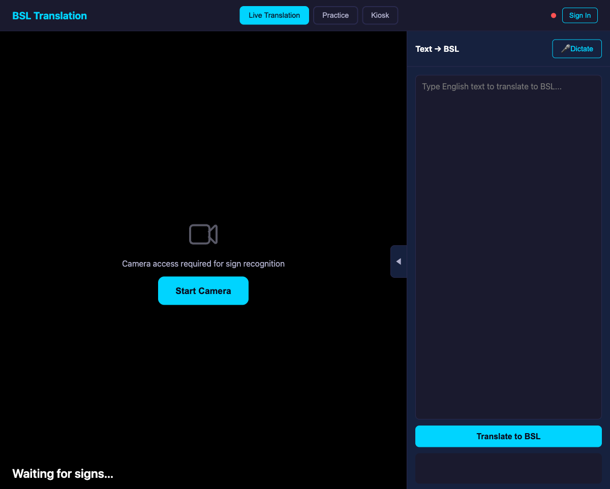
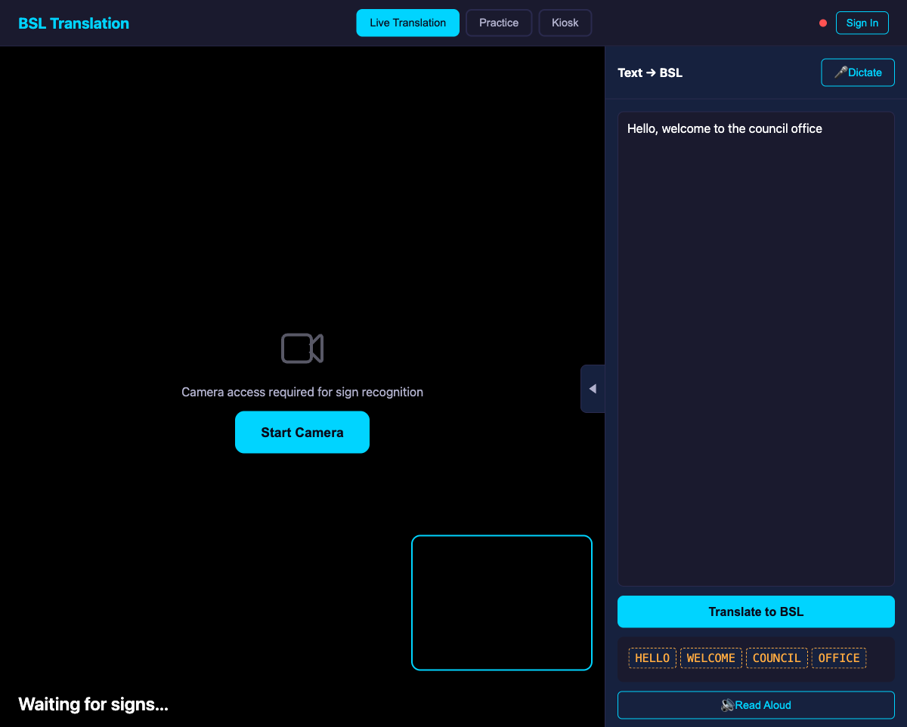

# Teaching a computer to understand British Sign Language — an experiment with NDX:Try

What happens when you give a curious person access to cloud computing and AI tools, point them at an interesting problem, and say "see what you can do"? That's essentially what NDX:Try is designed for — and this is a story about one such experiment.

## The idea

Around 87,000 people in the UK use British Sign Language (BSL) as their first or preferred language. For many of them, interacting with public services — councils, government departments, the NHS — means navigating systems built entirely around English. There are interpreters and relay services, but they're not always available, and they're expensive. What if a browser — just a normal web page — could recognise sign language in real time?

That was the question. Not "can we build a production service" — that's a much bigger ask with years of work behind it. The question was simpler: *is this even feasible?* Could a local government officer, or a team in a digital unit, explore this idea without needing to procure GPU servers, negotiate data agreements, or stand up ML infrastructure from scratch?

## What NDX:Try gives you

NDX:Try is a free platform that provides UK public sector organisations with temporary AWS environments for experimentation. You get a sandbox account — an isolated, time-limited AWS environment with guardrails — and you can use it to try things out. Pre-built scenarios cover common use cases like chatbots and dashboards, but the sandbox itself is open. You can spin up virtual machines, use AI services, store data, and run experiments.

The key thing is that it's *safe*. The sandbox accounts are isolated from production systems. They auto-clean when your session expires. There's no risk of accidentally exposing real data or racking up unexpected bills. It's designed for exactly this kind of thing: "I have an idea, I want to see if it works."

## Starting small

The first version of the BSL recogniser was deliberately simple. MediaPipe — Google's open-source pose estimation library — runs entirely in the browser. Point your webcam at someone signing, and MediaPipe gives you coordinates for 33 body landmarks, 468 facial landmarks, and 42 hand landmarks, all in real time. No server needed.

The challenge is turning those landmark coordinates into a recognised sign. BSL signs are defined by six phonological parameters: where your hands are (location), how they move (movement), what shape they make (handshape), which way the palm faces (orientation), whether one or both hands are used, and whether the hand touches the body (contact). We built scoring functions for each of these and defined 270 signs by hand.

It sort of worked. On a good day, with clear signing, in good light, it could recognise some signs. But "sort of worked" isn't good enough to answer the question of whether this approach is feasible.

## The prototype

Even at this early stage, we built out a full interface to see what the experience might feel like. The prototype has three modes:


*The main interface: camera feed on the left for sign recognition, text-to-BSL translation panel on the right. Three modes — Live Translation, Practice, and Kiosk — let you explore different interaction patterns.*

The text-to-BSL direction uses Amazon Bedrock's Claude to translate English sentences into BSL gloss notation — the written representation of sign language that captures its distinct grammar. "Hello, welcome to the council office" becomes the gloss sequence HELLO, WELCOME, COUNCIL, OFFICE.


*English to BSL translation. The AI translates natural English into BSL gloss notation, which follows BSL grammar rather than English word order. "Hello, how are you today?" becomes TODAY IX-2P HOW — BSL puts time references first.*


*BSL has its own grammar. The sentence "Hello, how are you today?" translates to the gloss sequence TODAY, IX-2P (a pronoun pointing sign), HOW — demonstrating how BSL front-loads time references.*

Practice mode lets you learn signs with reference videos, categorised by context — Greetings, Council Services, Directions, Emergency — with a star rating for how well the recogniser matched your attempt.


*Practice mode: pick a category, watch the reference video, try the sign yourself, and get rated. A gamified way to explore whether recognition actually works in practice.*

## The machine learning pivot

The hand-crafted approach hit a ceiling quickly. Categorical scoring — "is the hand near the forehead? yes or no" — threw away too much information. Real signing is fluid and variable. The same sign performed by different people looks surprisingly different in raw landmark data.

So we pivoted to machine learning. Instead of defining signs manually, we'd train a classifier on real sign language videos. This is where the sandbox started earning its keep.

The first ML model was trained on synthetic data — one video per sign, with computer-generated variations. It scored 11.8% accuracy on our test set of 119 signs. Fourteen signs out of 119. Terrible.

The breakthrough came from real data. BSLDict, an academic dataset from Oxford's Visual Geometry Group, contains over 14,000 video clips of BSL signs performed by 124 different signers. When we trained on multi-signer data — even just 4-5 videos per sign from different people — accuracy jumped to 86.6%. Real human variance in signing, it turns out, is something you can't synthesise.

| Version | Signs | Accuracy | What changed |
|---------|-------|----------|-------------|
| v14 | 119 | 11.8% | ML with synthetic data (1 video per sign) |
| v15 | 119 | 86.6% | Real multi-signer data from BSLDict |
| v16 | 944 | 85.7% | 8x vocabulary expansion, minimal accuracy loss |
| v18 | 14,948 | 89.6% | Mega-training across 7 data sources |

## Scaling up with cloud compute

With the approach validated on 119 signs, the obvious question was: how far can we push this? BSL has thousands of signs in everyday use. Could we scale from 119 to hundreds, or thousands?

This is where the sandbox's compute capabilities became essential. Training a neural network classifier on video-extracted features isn't something you do comfortably on a laptop. We spun up EC2 instances — first a c5.4xlarge with 16 CPU cores and 32GB of RAM — and built an automated pipeline.

### The training architecture

```
┌────────────────────────────────────────────────────────────────┐
│                    Training Pipeline (EC2)                     │
│                                                                │
│  ┌───────────┐   ┌───────────┐   ┌──────────┐   ┌────────────┐ │
│  │  Video    │──▶│ MediaPipe │──▶│ Feature  │──▶│   Train    │ │
│  │ Sources   │   │ Holistic  │   │ Extract  │   │  PyTorch   │ │
│  │ (27,000+) │   │ Landmarks │   │ 142-dim  │   │    MLP     │ │
│  └───────────┘   └───────────┘   └──────────┘   └─────┬──────┘ │
│                                                       │        │
│  Sources:                                             ▼        │
│  • BSLDict (Oxford, 13,090 videos)          ┌──────────────┐   │
│  • BSL SignBank (UCL, 3,586)                │ ONNX Export  │   │
│  • Auslan (8,561)                           │  (27MB)      │   │
│  • NZSL (4,805)                             └──────┬───────┘   │
│  • Dicta-Sign (1,019)                              │           │
│  • SSC STEM (2,682)                                │           │
│  • Christian-BSL (580)                             │           │
│  • BKS (2,072)                                     │           │
└────────────────────────────────────────────────────┼───────────┘
                                                     │
                           ┌─────────────────────────┘
                           ▼
┌─────────────────────────────────────────────────┐
│              Browser (no server needed)         │
│                                                 │
│  ┌─────────┐   ┌───────────┐   ┌─────────────┐  │
│  │ Webcam  │──▶│ MediaPipe │──▶│ ONNX Runtime│  │
│  │         │   │ (browser) │   │  Web (27MB) │  │
│  └─────────┘   └───────────┘   └──────┬──────┘  │
│                                        │        │
│                                        ▼        │
│                                 ┌────────────┐  │
│                                 │ Recognised │  │
│                                 │   Sign     │  │
│                                 └────────────┘  │
└─────────────────────────────────────────────────┘
```

The pipeline ran across multiple data sources: BSLDict from Oxford, BSL SignBank from UCL, Dicta-Sign from an EU research project, Christian-BSL videos, New Zealand Sign Language and Auslan — both part of the same BANZSL language family as BSL, sharing roughly 82% of their vocabulary.

We ended up processing over 27,000 videos. The EC2 instance ran for nearly four days straight, extracting landmarks and training the model. At peak, it was using 675% CPU across its 16 cores — all of them maxed out, with the SSH daemon so starved for resources that we could only connect intermittently to check progress.

## The messy reality of experiments

Blog posts about ML projects tend to present a clean narrative: we had an idea, we tried it, it worked. The reality was considerably messier, and that's worth talking about because it's the reality of experimentation.

### The sandbox ran out

NDX:Try sandbox sessions are time-limited — that's a feature, not a bug, because it keeps costs controlled and prevents abandoned infrastructure from accumulating. But our training run took nearly four days of continuous compute. The first sandbox session expired mid-training. We had to start a fresh session, re-provision the EC2 instance, and restart from a checkpoint. The data was safe on S3, but the interruption cost us hours of re-setup.

This is actually a useful finding for the platform: some experiments need longer-running compute than a standard session allows. The sandbox handled this gracefully — we didn't lose data, just time — but it highlighted that ML training workloads have different lifecycle patterns from typical evaluation tasks.

### SSH starvation

When you run a CPU-intensive training job at 675% utilisation on a 16-core instance, the operating system has very little headroom left for anything else. The SSH daemon — the way we connected to check progress — became intermittently unreachable. Sometimes it would take 10-15 attempts to get a connection. Other times we'd connect, check the training log, and get disconnected mid-command.

We worked around this by writing training logs to a file and uploading checkpoints to S3, so we could monitor progress even when SSH was unreliable. But it was a reminder that running long compute jobs on shared-purpose instances requires some operational awareness.

### GPU quota limits

When we tried to speed up the final training phase by launching a GPU instance (g4dn.xlarge with an NVIDIA Tesla T4), we hit a GPU vCPU quota of zero. This isn't a sandbox restriction — it's standard behaviour for new AWS accounts. GPU instances need an explicit quota increase request, which goes through AWS support. The approval came through within a couple of hours, but that's time eaten out of a sandbox session that's already ticking down.

It's the kind of thing you only learn by trying. And once you know, you know — request your GPU quota early, before you need it.

### Data: finding it, downloading it, licensing it

The feature extraction pipeline involved downloading videos from half a dozen academic sources, each with different formats, connection reliability, and rate limits. The Auslan Signbank download hit connection resets periodically and slowed to a crawl. The SSC STEM extraction died at 57% completion. We built retry logic, checkpointing, and parallel extraction to handle this — but it was a reminder that ML data pipelines are inherently brittle.

The bigger issue is licensing. For a research experiment like this, downloading publicly available sign language videos and training a model is reasonable. But the licensing landscape for BSL data is a patchwork:

| Source | License | Notes |
|--------|---------|-------|
| BSLDict (Oxford VGG) | Unclear — "check license before use" | Videos sourced from signbsl.com contributors |
| BSL SignBank (UCL) | No explicit content license | Software is BSD-3-Clause, content terms unstated |
| Auslan Signbank | CC BY-NC-ND 4.0 | Non-commercial, no derivatives |
| Dicta-Sign | EU project — terms unclear | Contact University of Hamburg |
| SSC STEM | University of Edinburgh IP | Explicit permission required |
| Christian-BSL | Not stated | Publicly available videos |
| NZSL | CC BY 4.0 (via BANZ-FS) | Permissive |

For an experiment running in a sandbox, this is fine — we're not distributing or commercialising anything. But it highlights a real challenge for anyone wanting to take sign language recognition further. The best BSL datasets either have unclear licensing or are locked behind academic access requirements.

The most notable example is **BOBSL** — the BBC-Oxford British Sign Language dataset. It contains 1,400 hours of interpreted BBC content with 2,281 sign classes and would be transformative training data. But access is restricted to academic research institutions under BBC Terms of Use. Independent researchers, students, and commercial organisations are explicitly excluded. For a public sector innovation experiment, that door is closed.

This is a pattern across sign language AI research more broadly. The data exists, the techniques are proven, but the path from experiment to product runs through licensing negotiations that can take months. It's an area where more openly-licensed BSL data would make a significant difference.

## Where we are now

The current model — version 18 — recognises 14,948 distinct signs. That's not a typo. From 119 to nearly fifteen thousand, with cross-validated accuracy holding steady at 89.6% top-1 and 98.7% top-5. The model runs entirely in the browser using ONNX Runtime Web. No server calls needed for inference. It's a 27MB file that loads once and then classifies signs in milliseconds.

```
                    Model progression

  Signs  │
 15,000  │                                          ██ v18
         │                                          ██ 14,948 signs
         │                                          ██ 89.6% accuracy
 10,000  │                                          ██
         │                                          ██
  5,000  │                                          ██
         │                                          ██
  1,000  │                                ██ v16    ██
         │                                ██ 944    ██
         │          ██ v15      ██ v15    ██ signs  ██
     100 │ ██ v14   ██ 119      ██ 119    ██ 85.7%  ██
         │ ██ 119   ██          ██        ██        ██
         │ ██ 11.8% ██ 86.6%    ██        ██        ██
       0 ┼──────────────────────────────────────────────
           Synthetic  Multi-   Hand-     Expanded   Mega
           data       signer   crafted   vocab      training
           (failed)   (break-  scoring              (7 sources,
                      through)                       4 days EC2)
```

Version 19 is currently in training on a GPU instance, adding 8,561 Auslan videos to the mix. The whole thing — the training data, the models, the extraction pipeline — sits in an S3 bucket using about 30GB of storage. The trained model runs from a static web page with no ongoing infrastructure cost for inference.

### What the 30GB contains

```
S3 Bucket: bsl-training-305137865866 (30.1 GB)
├── data/           19.4 GB  — 37,069 training videos across all sources
│   ├── auslan/      5.6 GB  — 8,561 Auslan Signbank videos
│   ├── bsl-signbank/         — BSL SignBank (UCL)
│   ├── nzsl/                 — New Zealand Sign Language
│   ├── dicta-sign/           — EU research project
│   ├── christian-bsl/        — domain-specific BSL
│   └── bks/                  — additional BSL data
├── videos/          1.6 GB  — 13,090 BSLDict videos (Oxford VGG)
├── ssc-stem/        5.1 GB  — 4,554 Scottish Sensory Centre STEM signs
├── cache/           0.5 GB  — extracted feature vectors (142-dim per video)
├── output/          1.2 GB  — trained ONNX models + metadata
│   ├── bsl_classifier_v17.onnx
│   ├── bsl_classifier_v18.onnx  (27MB, 14,948 classes)
│   └── model_metadata_v18.json  (label map + scaler params)
└── scripts/                  — training pipeline code
```

## Nobody wrote any code

It's worth pausing on something that might not be obvious from the technical detail above: nobody sat down and wrote code for this project. Not the MediaPipe integration, not the PyTorch training pipeline, not the ONNX export, not the feature extraction scripts, not the browser-based classifier, not the download scrapers for seven different academic data sources. Not even this blog post.

The entire project was built using Claude Code — Anthropic's AI coding assistant — driven by spec-based development using the BMAD methodology. We described outcomes: "we want to recognise BSL signs in a browser." The AI did the research — surveying academic datasets, evaluating what was publicly available, mapping out the landscape of BSL corpora and their licensing terms. It produced documentation: a technical specification, architecture decisions, a data sources analysis. Then it wrote the code, iterated on it when things didn't work, debugged the failures, and adapted its approach.

When the first ML model scored 11.8%, we didn't go back and hand-tune the code. We described the problem — "this isn't working, the synthetic data doesn't generalise" — and the AI researched alternatives, found BSLDict, wrote the download scripts, built the multi-signer training pipeline, and got us to 86.6%. When we wanted to scale to thousands of signs, it provisioned EC2 instances, wrote parallel extraction scripts, built the merge-and-train pipeline, and managed the four-day training run — monitoring progress, handling SSH timeouts, restarting failed processes.

The human contribution was direction and judgement. Which ideas to pursue. When to pivot. Whether the accuracy was good enough. Whether the experiment was worth continuing. The AI handled the research, the implementation, the infrastructure, and the iteration.

This matters because it changes the profile of who can do this kind of work. You don't need to be a machine learning engineer. You don't need to know PyTorch, or MediaPipe, or how to configure EC2 instances, or how to export ONNX models. You need curiosity, a clear idea of what you're trying to achieve, and the judgement to evaluate whether it's working. The AI and the sandbox between them handle the rest.

That's a genuinely new capability for public sector innovation. The combination of free compute (the sandbox), free AI assistance (the coding agent), and open data (academic datasets) means that the limiting factor for experimentation is no longer technical skill or budget. It's imagination.

## What this doesn't prove

Let's be honest about how far this is from being useful.

**The vocabulary isn't big enough.** BSL has somewhere between 20,000 and 100,000 key signs in active use, depending on how you count. Our 14,948 signs don't even cover the minimum. And that's before you account for the fact that BSL — like any living language — has dialects, regional variations, and local idioms. The sign for "bread" in London isn't necessarily the sign for "bread" in Glasgow. A model trained on academic reference videos from a handful of sources has no awareness of this variation.

**BSL is a language, not a vocabulary list.** Recognising individual signs is to understanding BSL what recognising individual words is to understanding spoken English — necessary but nowhere near sufficient. BSL has its own grammar, which is fundamentally different from English. It uses space, facial expressions, body movement, and timing as grammatical structures. Two signs performed in different locations relative to the body can mean completely different things. A raised eyebrow isn't decoration — it's grammar. None of this is captured by a model that classifies isolated signs.

**This was built by someone who doesn't know BSL.** I started this experiment with only a superficial understanding of British Sign Language. The process of doing it taught me an enormous amount — about BSL as a language, about its linguistic structure, about the deaf community's relationship with technology, about how much I didn't know. But that's precisely the point: this wasn't built with domain expertise. It was built with curiosity. The result reflects that. A prototype built without deep BSL knowledge is a demonstration of what AI tools can do, not a demonstration of what BSL technology should look like.

**It hasn't been tested with deaf BSL users.** The test set uses reference videos, not real-world signing. User testing with the deaf community would be essential before drawing any conclusions about practical utility — and that community's input should shape any future direction, not just validate a technical approach.

**The accuracy numbers come with caveats.** 89.6% accuracy across 14,948 signs sounds impressive, but the model was trained and tested on similar data distributions. Real-world performance, with real signers, in real environments, will be different.

Fundamentally, this was an experiment in using video processing and machine learning — and in that framing, it's genuinely interesting. Can you take a webcam feed, extract body landmarks in real time, and classify what someone is doing with their hands? Yes, it turns out you can, with surprising accuracy. Whether that specific capability is useful for sign language recognition, or for something else entirely, is a separate question.

## What this does prove

The experiment demonstrates something more fundamental than any particular accuracy number:

**A single person with a laptop and a sandbox can explore ideas that would previously have required a dedicated ML team.** The entire experiment — from "I wonder if this is possible" to a working prototype with nearly 15,000 signs — was done without writing a line of code manually. No ML engineers, no frontend developers, no DevOps team. Just a person with an idea, an AI assistant, and a sandbox.

**The barrier to experimentation has collapsed.** The compute for this project would have cost tens of thousands of pounds a decade ago. The academic datasets we used are openly available. The open-source tools are free. The sandbox environment is free. The AI writes the code. What's left is the idea and the willingness to try.

**Public sector innovation doesn't need to start with a business case.** This experiment might lead somewhere useful, or it might not. The point is that someone was able to try — to ask "what if?" and actually explore the answer — without procurement, without a project board, without a budget. That's what sandbox environments are for.

**Experiments are supposed to be messy.** We hit GPU quota limits, SSH timeouts, expired sandbox sessions, flaky data downloads, and training runs that took four days instead of four hours. None of that meant the experiment failed — it meant we were learning. Every one of those problems taught us something about running ML workloads in cloud environments, and that knowledge transfers to whatever comes next.

## What's next

We're continuing to train on additional data sources and exploring whether the model generalises to continuous signing rather than isolated signs. The CloudFormation template for deploying this as a Try scenario is in progress, so other organisations can spin it up and explore for themselves.

If you're in UK public sector and you have an idea you'd like to explore with AWS — whether it's AI, data, infrastructure, or something else entirely — NDX:Try is there for exactly that. The worst that can happen is that your experiment doesn't work. And that's fine. That's what experiments are for.

---

*NDX:Try is available to UK public sector organisations at [aws.try.ndx.digital.cabinet-office.gov.uk](https://aws.try.ndx.digital.cabinet-office.gov.uk). The BSL Sign Language Recognition scenario and all training code are open source.*
