# Epic 25: LocalGov Drupal Scenario - Technical Specification

**Epic ID:** 25
**Author:** Architecture Team
**Date:** 2025-12-23
**Status:** Draft
**PRD Version:** 1.8
**Total Story Points:** 34

---

## Executive Summary

This technical specification details the implementation of the LocalGov Drupal scenario for NDX:Try AWS Scenarios. The scenario demonstrates containerized CMS deployment on AWS, showing UK councils how to run modern web platforms with managed infrastructure.

**Key Deliverables:**
- Standalone CloudFormation template (no CDK bootstrap)
- Pre-built Drupal container image in ECR
- Database initialization with sample council content
- Portal integration with walkthrough guides
- Architecture diagrams and documentation

**Technical Constraints:**
- Must deploy without CDK bootstrap (SCP restriction in Innovation Sandbox)
- Must complete deployment in <15 minutes
- Must use cost-efficient resources (RDS MySQL t3.micro, single Fargate task)
- Must include health check workaround for Drupal Host header validation

---

## PRD Traceability Matrix

### Functional Requirements Coverage

| FR ID | Requirement | Story | Implementation |
|-------|-------------|-------|----------------|
| FR236 | Scenario available in gallery | 25.4 | scenarios.yaml entry |
| FR237 | Realistic council sample data | 25.3 | SQL init script with GDS content |
| FR238 | Working Drupal installation | 25.2, 25.3 | Pre-built image + database init |
| FR239 | Deploy without CDK bootstrap | 25.1 | Standalone CloudFormation |
| FR240 | RDS MySQL (not Aurora) | 25.1 | DatabaseInstance construct |
| FR241 | Public subnets only | 25.1 | VPC with no NAT gateways |
| FR242 | ECS Fargate orchestration | 25.1 | FargateService + ALB |
| FR243 | ALB with public DNS | 25.1 | ApplicationLoadBalancer output |
| FR244 | Pre-built ECR image | 25.2 | Dockerfile + ECR push |
| FR245 | Health check accepts 400 | 25.1 | TargetGroup matcher config |
| FR246 | Accessible within 10 min | 25.1 | Optimized resource creation |
| FR247 | Clear deployment status | 25.5 | Walkthrough documentation |
| FR248 | Pre-seeded demo content | 25.3 | Drush site-install + content |
| FR249 | Guided walkthrough | 25.5 | Step-by-step guide |
| FR250 | Architecture diagram | 25.6 | Mermaid diagrams |

### Non-Functional Requirements Coverage

| NFR ID | Requirement | Story | Implementation |
|--------|-------------|-------|----------------|
| NFR79 | Deploy in <15 min | 25.1, 25.7 | Resource optimization, validation |
| NFR80 | RDS t3.micro/small | 25.1 | InstanceType parameter |
| NFR81 | Fargate 0.5vCPU/1GB | 25.1 | TaskDefinition sizing |
| NFR82 | Auto-cleanup in 90 min | 25.1 | Lambda cleanup function |
| NFR83 | No IAM user credentials | 25.1 | Execution role only |

---

## Technical Architecture

### Dev/Sandbox Stack Architecture

```
┌─────────────────────────────────────────────────────────────────┐
│                           Internet                               │
└────────────────────────────┬────────────────────────────────────┘
                             │
┌────────────────────────────▼────────────────────────────────────┐
│                    Application Load Balancer                     │
│                 (Public DNS: *.us-east-1.elb.amazonaws.com)     │
│                                                                  │
│  Health Check: / → HTTP 200,301,302,400,403                     │
└────────────────────────────┬────────────────────────────────────┘
                             │ Port 80
┌────────────────────────────▼────────────────────────────────────┐
│                        ECS Fargate Service                       │
│                                                                  │
│  ┌──────────────────────────────────────────────────────────┐   │
│  │  Task Definition                                          │   │
│  │  - CPU: 512 (0.5 vCPU)                                   │   │
│  │  - Memory: 1024 MB                                        │   │
│  │  - Image: {account}.dkr.ecr.us-east-1.amazonaws.com/     │   │
│  │           ndx-try-localgov-drupal:latest                 │   │
│  │  - Port: 80 (TCP)                                         │   │
│  └──────────────────────────────────────────────────────────┘   │
│                                                                  │
│  Desired Count: 1                                                │
│  Assign Public IP: true                                          │
└────────────────────────────┬────────────────────────────────────┘
                             │ Port 3306
┌────────────────────────────▼────────────────────────────────────┐
│                     RDS MySQL Instance                           │
│                                                                  │
│  Engine: MySQL 8.0                                               │
│  Instance Class: db.t3.micro                                     │
│  Storage: 20 GB (gp2)                                            │
│  Multi-AZ: false                                                 │
│  Publicly Accessible: true (for sandbox only)                    │
│  Database Name: drupal                                           │
│  Credentials: Secrets Manager (auto-generated)                   │
└─────────────────────────────────────────────────────────────────┘
                             │
┌────────────────────────────▼────────────────────────────────────┐
│                            VPC                                   │
│                                                                  │
│  CIDR: 10.0.0.0/16                                              │
│  AZs: 2 (us-east-1a, us-east-1b)                                │
│                                                                  │
│  ┌─────────────────┐    ┌─────────────────┐                     │
│  │ Public Subnet 1 │    │ Public Subnet 2 │                     │
│  │ 10.0.0.0/24     │    │ 10.0.1.0/24     │                     │
│  │ AZ: us-east-1a  │    │ AZ: us-east-1b  │                     │
│  └─────────────────┘    └─────────────────┘                     │
│                                                                  │
│  NAT Gateways: 0 (cost optimization)                            │
│  Internet Gateway: 1                                             │
└─────────────────────────────────────────────────────────────────┘
```

### Production Reference Architecture (aws-samples CDK)

```
┌─────────────────────────────────────────────────────────────────┐
│                    CloudFront + AWS WAF                          │
└────────────────────────────┬────────────────────────────────────┘
                             │
┌────────────────────────────▼────────────────────────────────────┐
│                    Application Load Balancer                     │
└────────────────────────────┬────────────────────────────────────┘
                             │
┌────────────────────────────▼────────────────────────────────────┐
│                 ECS Fargate (Auto-scaling 2-N)                   │
│                                                                  │
│  ┌────────────┐  ┌────────────┐  ┌────────────┐                │
│  │   Task 1   │  │   Task 2   │  │   Task N   │                │
│  │  2vCPU/4GB │  │  2vCPU/4GB │  │  2vCPU/4GB │                │
│  └────────────┘  └────────────┘  └────────────┘                │
│                                                                  │
│  ┌──────────────────────────────────────────────────────────┐   │
│  │              EFS Volume (Persistent Storage)              │   │
│  │              /var/www/html/sites/default/files           │   │
│  └──────────────────────────────────────────────────────────┘   │
└────────────────────────────┬────────────────────────────────────┘
                             │
┌────────────────────────────▼────────────────────────────────────┐
│                    Aurora Serverless v2                          │
│                    (0.5-16 ACU auto-scaling)                     │
└─────────────────────────────────────────────────────────────────┘
                             │
┌────────────────────────────▼────────────────────────────────────┐
│                            VPC                                   │
│  - 3 AZs                                                         │
│  - Public + Private subnets                                      │
│  - 3 NAT Gateways                                                │
└─────────────────────────────────────────────────────────────────┘
```

---

## Story Specifications

### Story 25.1: Create CloudFormation Template from CDK

**Story Points:** 8

**Context:**
The aws-samples CDK project produces templates requiring CDK bootstrap, which is blocked by SCP in Innovation Sandbox. This story creates a standalone CloudFormation template that deploys without bootstrap dependencies.

**Technical Approach:**
1. Export CDK template via `cdk synth`
2. Post-process to remove bootstrap references
3. Inline all IAM policies (no CDK asset references)
4. Add ECR permissions to task execution role
5. Configure health check matcher

**Acceptance Criteria:**

| # | Criteria | Validation |
|---|----------|------------|
| 1 | Template deploys without CDK bootstrap | No SSM parameter lookups |
| 2 | Creates VPC with 2 AZs, public subnets only | `aws ec2 describe-vpcs` |
| 3 | Creates RDS MySQL t3.micro | `aws rds describe-db-instances` |
| 4 | Creates ECS Cluster + Fargate Service | `aws ecs describe-services` |
| 5 | Creates ALB with public DNS | Stack output: LoadBalancerDNS |
| 6 | Health check accepts 200,301,302,400,403 | TargetGroup configuration |
| 7 | Deployment completes in <15 minutes | CloudFormation timing |
| 8 | Outputs: ALB DNS, RDS endpoint, ECS cluster | Stack outputs |
| 9 | Drupal admin credentials auto-generated | DrupalAdminPassword output |
| 10 | Admin credentials in Secrets Manager | DrupalAdminSecretArn output |

**CloudFormation Template Structure:**

```yaml
AWSTemplateFormatVersion: '2010-09-09'
Description: 'NDX:Try - LocalGov Drupal Scenario (Sandbox)'

Parameters:
  ECRImageUri:
    Type: String
    Description: ECR image URI for Drupal container
    Default: '982203978489.dkr.ecr.us-east-1.amazonaws.com/ndx-try-localgov-drupal:latest'

  EnvironmentTag:
    Type: String
    Default: 'ndx-try-sandbox'
    Description: Environment tag for cost tracking

  ScenarioTag:
    Type: String
    Default: 'localgov-drupal'
    Description: Scenario identifier for analytics

Resources:
  # VPC Resources
  VPC:
    Type: AWS::EC2::VPC
    Properties:
      CidrBlock: 10.0.0.0/16
      EnableDnsHostnames: true
      Tags:
        - Key: scenario
          Value: !Ref ScenarioTag

  PublicSubnet1:
    Type: AWS::EC2::Subnet
    Properties:
      VpcId: !Ref VPC
      CidrBlock: 10.0.0.0/24
      AvailabilityZone: !Select [0, !GetAZs '']
      MapPublicIpOnLaunch: true

  PublicSubnet2:
    Type: AWS::EC2::Subnet
    Properties:
      VpcId: !Ref VPC
      CidrBlock: 10.0.1.0/24
      AvailabilityZone: !Select [1, !GetAZs '']
      MapPublicIpOnLaunch: true

  InternetGateway:
    Type: AWS::EC2::InternetGateway

  VPCGatewayAttachment:
    Type: AWS::EC2::VPCGatewayAttachment
    Properties:
      VpcId: !Ref VPC
      InternetGatewayId: !Ref InternetGateway

  # RDS Resources
  DBSubnetGroup:
    Type: AWS::RDS::DBSubnetGroup
    Properties:
      DBSubnetGroupDescription: Subnets for RDS
      SubnetIds:
        - !Ref PublicSubnet1
        - !Ref PublicSubnet2

  DBSecurityGroup:
    Type: AWS::EC2::SecurityGroup
    Properties:
      GroupDescription: RDS MySQL access
      VpcId: !Ref VPC
      SecurityGroupIngress:
        - IpProtocol: tcp
          FromPort: 3306
          ToPort: 3306
          CidrIp: 10.0.0.0/16

  DBInstance:
    Type: AWS::RDS::DBInstance
    Properties:
      DBInstanceClass: db.t3.micro
      Engine: mysql
      EngineVersion: '8.0'
      AllocatedStorage: 20
      DBName: drupal
      MasterUsername: !Sub '{{resolve:secretsmanager:${DBSecret}:SecretString:username}}'
      MasterUserPassword: !Sub '{{resolve:secretsmanager:${DBSecret}:SecretString:password}}'
      DBSubnetGroupName: !Ref DBSubnetGroup
      VPCSecurityGroups:
        - !Ref DBSecurityGroup
      PubliclyAccessible: true
      DeletionProtection: false
      BackupRetentionPeriod: 0
      Tags:
        - Key: scenario
          Value: !Ref ScenarioTag

  DBSecret:
    Type: AWS::SecretsManager::Secret
    Properties:
      GenerateSecretString:
        SecretStringTemplate: '{"username": "drupaladmin", "dbname": "drupal"}'
        GenerateStringKey: password
        PasswordLength: 16
        ExcludeCharacters: '"@/\'

  # ECS Resources
  ECSCluster:
    Type: AWS::ECS::Cluster
    Properties:
      ClusterSettings:
        - Name: containerInsights
          Value: disabled

  TaskExecutionRole:
    Type: AWS::IAM::Role
    Properties:
      AssumeRolePolicyDocument:
        Version: '2012-10-17'
        Statement:
          - Effect: Allow
            Principal:
              Service: ecs-tasks.amazonaws.com
            Action: sts:AssumeRole
      ManagedPolicyArns:
        - arn:aws:iam::aws:policy/service-role/AmazonECSTaskExecutionRolePolicy
      Policies:
        - PolicyName: ECRAccess
          PolicyDocument:
            Version: '2012-10-17'
            Statement:
              - Effect: Allow
                Action:
                  - ecr:GetAuthorizationToken
                  - ecr:BatchCheckLayerAvailability
                  - ecr:GetDownloadUrlForLayer
                  - ecr:BatchGetImage
                Resource: '*'
        - PolicyName: SecretsAccess
          PolicyDocument:
            Version: '2012-10-17'
            Statement:
              - Effect: Allow
                Action:
                  - secretsmanager:GetSecretValue
                Resource: !Ref DBSecret

  TaskDefinition:
    Type: AWS::ECS::TaskDefinition
    Properties:
      Family: localgov-drupal
      Cpu: '512'
      Memory: '1024'
      NetworkMode: awsvpc
      RequiresCompatibilities:
        - FARGATE
      ExecutionRoleArn: !GetAtt TaskExecutionRole.Arn
      ContainerDefinitions:
        - Name: drupal
          Image: !Ref ECRImageUri
          PortMappings:
            - ContainerPort: 80
              Protocol: tcp
          Environment:
            - Name: DRUPAL_DB_HOST
              Value: !GetAtt DBInstance.Endpoint.Address
            - Name: DRUPAL_DB_PORT
              Value: '3306'
          Secrets:
            - Name: DRUPAL_DB_USER
              ValueFrom: !Sub '${DBSecret}:username::'
            - Name: DRUPAL_DB_PASSWORD
              ValueFrom: !Sub '${DBSecret}:password::'
            - Name: DRUPAL_DB_NAME
              ValueFrom: !Sub '${DBSecret}:dbname::'
          LogConfiguration:
            LogDriver: awslogs
            Options:
              awslogs-group: !Ref LogGroup
              awslogs-region: !Ref AWS::Region
              awslogs-stream-prefix: drupal

  LogGroup:
    Type: AWS::Logs::LogGroup
    Properties:
      RetentionInDays: 1

  # ALB Resources
  ALBSecurityGroup:
    Type: AWS::EC2::SecurityGroup
    Properties:
      GroupDescription: ALB access
      VpcId: !Ref VPC
      SecurityGroupIngress:
        - IpProtocol: tcp
          FromPort: 80
          ToPort: 80
          CidrIp: 0.0.0.0/0

  ApplicationLoadBalancer:
    Type: AWS::ElasticLoadBalancingV2::LoadBalancer
    Properties:
      Scheme: internet-facing
      SecurityGroups:
        - !Ref ALBSecurityGroup
      Subnets:
        - !Ref PublicSubnet1
        - !Ref PublicSubnet2
      Tags:
        - Key: scenario
          Value: !Ref ScenarioTag

  TargetGroup:
    Type: AWS::ElasticLoadBalancingV2::TargetGroup
    Properties:
      HealthCheckPath: /
      HealthCheckIntervalSeconds: 30
      Matcher:
        HttpCode: '200,301,302,400,403'  # Accept 400 for Drupal Host validation
      Port: 80
      Protocol: HTTP
      TargetType: ip
      VpcId: !Ref VPC

  Listener:
    Type: AWS::ElasticLoadBalancingV2::Listener
    Properties:
      LoadBalancerArn: !Ref ApplicationLoadBalancer
      Port: 80
      Protocol: HTTP
      DefaultActions:
        - Type: forward
          TargetGroupArn: !Ref TargetGroup

  FargateService:
    Type: AWS::ECS::Service
    DependsOn: Listener
    Properties:
      Cluster: !Ref ECSCluster
      DesiredCount: 1
      LaunchType: FARGATE
      TaskDefinition: !Ref TaskDefinition
      NetworkConfiguration:
        AwsvpcConfiguration:
          AssignPublicIp: ENABLED
          SecurityGroups:
            - !Ref ServiceSecurityGroup
          Subnets:
            - !Ref PublicSubnet1
            - !Ref PublicSubnet2
      LoadBalancers:
        - ContainerName: drupal
          ContainerPort: 80
          TargetGroupArn: !Ref TargetGroup

  ServiceSecurityGroup:
    Type: AWS::EC2::SecurityGroup
    Properties:
      GroupDescription: Fargate service access
      VpcId: !Ref VPC
      SecurityGroupIngress:
        - IpProtocol: tcp
          FromPort: 80
          ToPort: 80
          SourceSecurityGroupId: !Ref ALBSecurityGroup

  # Drupal Admin Credentials (auto-generated)
  DrupalAdminSecret:
    Type: AWS::SecretsManager::Secret
    Properties:
      Name: !Sub '${AWS::StackName}-drupal-admin'
      Description: Drupal admin credentials (auto-generated)
      GenerateSecretString:
        SecretStringTemplate: '{"username": "admin"}'
        GenerateStringKey: password
        PasswordLength: 16
        ExcludePunctuation: true  # Drupal-safe password

Outputs:
  LoadBalancerDNS:
    Description: ALB DNS Name
    Value: !GetAtt ApplicationLoadBalancer.DNSName

  ServiceURL:
    Description: Application URL
    Value: !Sub 'http://${ApplicationLoadBalancer.DNSName}'

  RDSEndpoint:
    Description: RDS Endpoint
    Value: !GetAtt DBInstance.Endpoint.Address

  ECSClusterName:
    Description: ECS Cluster Name
    Value: !Ref ECSCluster

  DrupalAdminUsername:
    Description: Drupal admin username
    Value: admin

  DrupalAdminSecretArn:
    Description: ARN of secret containing Drupal admin password
    Value: !Ref DrupalAdminSecret

  DrupalAdminPassword:
    Description: Drupal admin password (retrieve from Secrets Manager)
    Value: !Sub '{{resolve:secretsmanager:${DrupalAdminSecret}:SecretString:password}}'
```

**Post-Processing Script:**

```python
#!/usr/bin/env python3
"""
Strip CDK bootstrap references from synthesized template.
Run after: cdk synth --all --app "python app_dev.py"
"""
import json

TEMPLATES = ['DrupalDevCore', 'DrupalDevFargate']

for template_name in TEMPLATES:
    path = f'cdk.out/{template_name}.template.json'

    with open(path, 'r') as f:
        template = json.load(f)

    # Remove BootstrapVersion parameter
    if 'Parameters' in template:
        template['Parameters'].pop('BootstrapVersion', None)

    # Remove CheckBootstrapVersion rule
    if 'Rules' in template:
        template['Rules'].pop('CheckBootstrapVersion', None)
        if not template['Rules']:
            del template['Rules']

    with open(path, 'w') as f:
        json.dump(template, f, indent=2)

    print(f"Processed: {path}")
```

---

### Story 25.2: Build and Publish Drupal Container Image

**Story Points:** 5

**Technical Approach:**
1. Use official `drupal:10-apache` base image
2. Configure PHP settings for performance
3. Pre-install Drush for CLI management
4. Configure trusted host patterns
5. Push to ECR repository

**Dockerfile:**

```dockerfile
# Dockerfile for NDX:Try LocalGov Drupal
FROM drupal:10-apache

# Install additional PHP extensions and tools
RUN apt-get update && apt-get install -y \
    libzip-dev \
    unzip \
    && docker-php-ext-install zip \
    && rm -rf /var/lib/apt/lists/*

# Install Composer
COPY --from=composer:latest /usr/bin/composer /usr/bin/composer

# Install Drush globally
RUN composer global require drush/drush:^12 \
    && ln -s /root/.composer/vendor/bin/drush /usr/local/bin/drush

# Configure PHP for better performance
RUN echo "memory_limit = 256M" >> /usr/local/etc/php/conf.d/drupal.ini \
    && echo "upload_max_filesize = 32M" >> /usr/local/etc/php/conf.d/drupal.ini \
    && echo "post_max_size = 32M" >> /usr/local/etc/php/conf.d/drupal.ini

# Copy custom settings
COPY settings.php /var/www/html/sites/default/settings.php

# Set permissions
RUN chown -R www-data:www-data /var/www/html/sites

# Healthcheck
HEALTHCHECK --interval=30s --timeout=5s --start-period=60s --retries=3 \
    CMD curl -f http://localhost/ || exit 1

EXPOSE 80
```

**settings.php Configuration:**

```php
<?php
// NDX:Try LocalGov Drupal - Settings

$databases['default']['default'] = [
  'database' => getenv('DRUPAL_DB_NAME') ?: 'drupal',
  'username' => getenv('DRUPAL_DB_USER') ?: 'drupal',
  'password' => getenv('DRUPAL_DB_PASSWORD') ?: '',
  'host' => getenv('DRUPAL_DB_HOST') ?: 'localhost',
  'port' => getenv('DRUPAL_DB_PORT') ?: '3306',
  'driver' => 'mysql',
  'prefix' => '',
];

// Trusted host patterns - accept all for sandbox
$settings['trusted_host_patterns'] = [
  '.*',  // Accept all hosts in sandbox environment
];

// Hash salt from environment or generate
$settings['hash_salt'] = getenv('DRUPAL_HASH_SALT') ?: 'ndx-try-sandbox-salt-12345';

// File paths
$settings['file_public_path'] = 'sites/default/files';
$settings['file_private_path'] = '/var/www/private';

// Config sync directory
$settings['config_sync_directory'] = '/var/www/html/sites/default/files/config/sync';
```

**ECR Repository Setup:**

```bash
# Create ECR repository
aws ecr create-repository \
  --repository-name ndx-try-localgov-drupal \
  --region us-east-1 \
  --image-scanning-configuration scanOnPush=true

# Build and push
docker build -t ndx-try-localgov-drupal:latest -f Dockerfile .

aws ecr get-login-password --region us-east-1 | \
  docker login --username AWS --password-stdin 982203978489.dkr.ecr.us-east-1.amazonaws.com

docker tag ndx-try-localgov-drupal:latest \
  982203978489.dkr.ecr.us-east-1.amazonaws.com/ndx-try-localgov-drupal:latest

docker push 982203978489.dkr.ecr.us-east-1.amazonaws.com/ndx-try-localgov-drupal:latest
```

**Acceptance Criteria:**

| # | Criteria | Validation |
|---|----------|------------|
| 1 | Based on drupal:10-apache | Dockerfile FROM statement |
| 2 | Drush CLI installed | `drush --version` in container |
| 3 | Image tagged in ECR | `aws ecr describe-images` |
| 4 | Image size <500MB | `docker images` |
| 5 | Healthcheck configured | Dockerfile HEALTHCHECK |
| 6 | Trusted hosts accept ALB | settings.php patterns |

---

### Story 25.3: Create Sample Content and Database Initialization

**Story Points:** 8

**Technical Approach:**
1. Use Drush site-install for initial database setup
2. Create sample content via migration YAML
3. Package as Lambda custom resource OR init container
4. Store admin credentials in Secrets Manager

**Database Initialization Lambda:**

```python
import json
import boto3
import cfnresponse
import pymysql
import subprocess
import os

def handler(event, context):
    """
    Custom resource to initialize Drupal database.
    Runs Drush site-install and creates sample content.
    """
    if event['RequestType'] == 'Delete':
        cfnresponse.send(event, context, cfnresponse.SUCCESS, {})
        return

    try:
        # Get database credentials from Secrets Manager
        secrets = boto3.client('secretsmanager')
        secret = json.loads(
            secrets.get_secret_value(SecretId=os.environ['DB_SECRET_ARN'])['SecretString']
        )

        # Connect to database
        conn = pymysql.connect(
            host=os.environ['DB_HOST'],
            user=secret['username'],
            password=secret['password'],
            database=secret['dbname']
        )

        # Get Drupal admin credentials from Secrets Manager
        admin_secret = json.loads(
            secrets.get_secret_value(SecretId=os.environ['ADMIN_SECRET_ARN'])['SecretString']
        )
        admin_password = admin_secret['password']

        # Run Drush site-install (via ECS Exec or Lambda container)
        result = subprocess.run([
            'drush', 'site:install', 'standard',
            f"--db-url=mysql://{secret['username']}:{secret['password']}@{os.environ['DB_HOST']}/{secret['dbname']}",
            '--account-name=admin',
            f'--account-pass={admin_password}',
            '--site-name=NDX:Try LocalGov Drupal Demo',
            '-y'
        ], capture_output=True, text=True)

        if result.returncode != 0:
            raise Exception(f"Drush failed: {result.stderr}")

        # Create sample content
        create_sample_content(conn)

        cfnresponse.send(event, context, cfnresponse.SUCCESS, {
            'Message': 'Drupal initialized successfully. See CloudFormation outputs for credentials.'
        })

    except Exception as e:
        cfnresponse.send(event, context, cfnresponse.FAILED, {'Error': str(e)})

def create_sample_content(conn):
    """Create sample pages for demonstration."""
    cursor = conn.cursor()

    # Sample content SQL would go here
    # This creates: homepage, about, services (3), news (2)

    cursor.close()
    conn.commit()
```

**Sample Content Structure:**

| Page | Title | Path | Content |
|------|-------|------|---------|
| Homepage | Welcome to Sample Council | / | Council services overview |
| About | About Us | /about | Council mission and structure |
| Service 1 | Waste & Recycling | /services/waste | Bin collection information |
| Service 2 | Planning Applications | /services/planning | How to apply |
| Service 3 | Council Tax | /services/council-tax | Payment information |
| News 1 | New Recycling Service | /news/recycling | Launch announcement |
| News 2 | Planning Portal Update | /news/planning-portal | System improvements |

**Acceptance Criteria:**

| # | Criteria | Validation |
|---|----------|------------|
| 1 | Drupal database schema created | `drush status` |
| 2 | Sample content: 7 pages minimum | Drupal content list |
| 3 | Admin credentials auto-generated | CloudFormation output: DrupalAdminPassword |
| 4 | Admin password in Secrets Manager | DrupalAdminSecretArn output |
| 5 | GDS-compatible content patterns | Visual inspection |
| 6 | Database credentials in Secrets Manager | CloudFormation output |

---

### Story 25.4: Create Scenario Metadata and Portal Page

**Story Points:** 3

**scenarios.yaml Entry:**

```yaml
- id: "localgov-drupal"
  name: "LocalGov Drupal"
  headline: "Modern containerized CMS for council websites"
  bestFor: "Councils modernizing legacy web infrastructure"
  description: |
    Deploy the LocalGov Drupal distribution on AWS with managed containers,
    database, and load balancing. Experience how councils can run shared
    web platforms without managing servers.
  longDescription: |
    LocalGov Drupal is a collaborative Drupal distribution designed specifically
    for UK councils. This scenario demonstrates how to deploy it on AWS using
    modern containerized infrastructure with ECS Fargate, managed MySQL database,
    and automatic load balancing.

    You'll experience:
    - One-click deployment of a complete CMS stack
    - Pre-configured Drupal with sample council content
    - Managed database with automatic backups
    - Container orchestration without managing servers
  difficulty: "advanced"
  timeEstimate: "15-20 minutes"
  primaryPersona: "technical"
  secondaryPersonas:
    - "service-manager"
    - "cto"
  awsServices:
    - name: "Amazon ECS Fargate"
      description: "Serverless container orchestration"
    - name: "Amazon RDS MySQL"
      description: "Managed relational database"
    - name: "Application Load Balancer"
      description: "HTTP traffic distribution"
    - name: "Amazon VPC"
      description: "Network isolation"
    - name: "Amazon ECR"
      description: "Container image registry"
  tags:
    - "CMS"
    - "Containers"
    - "Web Platform"
    - "Infrastructure"
    - "Drupal"
  relatedScenarios:
    - "council-chatbot"
    - "planning-application-ai"
  costEstimate:
    sandbox: "$0.09"
    production: "$185-450/month"
  cloudformationTemplate: "cloudformation/templates/localgov-drupal.yaml"
  status: "active"
```

**Portal Page Structure:**

```markdown
---
title: "LocalGov Drupal"
layout: "scenario.njk"
scenario_id: "localgov-drupal"
tags: ["CMS", "Containers", "Infrastructure"]
---

## What is LocalGov Drupal?

LocalGov Drupal is a collaborative initiative by UK councils to build a shared
Drupal distribution tailored for local government websites. Over 30 councils
contribute to the platform, sharing development costs and best practices.

## What You'll Experience

In this scenario, you'll deploy a containerized Drupal installation on AWS and:

1. **See modern container deployment** - Watch ECS Fargate launch your CMS without
   managing any servers
2. **Explore managed database** - RDS MySQL handles backups, patching, and scaling
3. **Experience load balancing** - ALB distributes traffic and handles health checks
4. **Create content** - Log into Drupal admin and create a page

## AWS Services Used

| Service | Purpose | Sandbox Cost |
|---------|---------|--------------|
| ECS Fargate | Run Drupal container | ~$0.05/90 min |
| RDS MySQL | Store content database | ~$0.02/90 min |
| ALB | Distribute traffic | ~$0.02/90 min |
| VPC | Network isolation | Free |

## Time to Value

- **Deployment:** 10-15 minutes
- **First login:** 2 minutes after deployment
- **Create a page:** 5 minutes

## Who Is This For?

**Web Platform Teams:** See how containerization simplifies CMS deployment
**IT Infrastructure:** Understand managed services vs. self-hosted
**Digital Leaders:** Evaluate AWS for council website modernization

## Deploy This Scenario

[Deploy Button → CloudFormation Quick Create]

## What's Next?

After exploring this scenario:
- Generate an Evidence Pack for committee presentation
- Compare with production architecture (CloudFront + WAF + Aurora)
- Explore the LocalGov Drupal community: localgovdrupal.org
```

**Acceptance Criteria:**

| # | Criteria | Validation |
|---|----------|------------|
| 1 | Entry in scenarios.yaml | File validation |
| 2 | Portal page at /scenarios/localgov-drupal/ | URL access |
| 3 | All required fields populated | Schema validation |
| 4 | Related scenarios linked | Link check |
| 5 | Cost estimates accurate | Manual verification |

---

### Story 25.5: Create Deployment Walkthrough Guide

**Story Points:** 3

**Walkthrough Structure:**

```markdown
# LocalGov Drupal - Deployment Walkthrough

## Before You Start

**Time Required:** 15-20 minutes
**Prerequisites:** AWS Console access to Innovation Sandbox

## Step 1: Deploy the Stack (5-10 minutes)

1. Click the **Deploy to AWS** button on the scenario page
2. You'll be taken to the CloudFormation Quick Create page
3. Review the parameters (defaults are fine for sandbox)
4. Check "I acknowledge that AWS CloudFormation might create IAM resources"
5. Click **Create stack**

### What's Happening

CloudFormation is creating:
- A VPC with public subnets in 2 availability zones
- An RDS MySQL database instance
- An ECS cluster with Fargate task
- An Application Load Balancer

**Expected Time:** 10-15 minutes

### How to Check Progress

1. Go to CloudFormation Console
2. Click on your stack (LocalGovDrupal-*)
3. Watch the Events tab for progress
4. Wait for CREATE_COMPLETE status

## Step 2: Access Your Drupal Site (2 minutes)

1. Go to the CloudFormation Outputs tab
2. Find **ServiceURL** - this is your Drupal site
3. Click the URL to open in a new tab
4. You should see the Drupal homepage

### Troubleshooting

If you see a 503 error:
- The Fargate task may still be starting
- Wait 2-3 minutes and refresh
- Check ECS Console for task status

## Step 3: Log In to Admin (2 minutes)

1. Go to the CloudFormation **Outputs** tab
2. Copy the **DrupalAdminPassword** value
3. Navigate to: `http://[your-alb-url]/user/login`
4. Username: `admin` (shown in DrupalAdminUsername output)
5. Password: Paste the password from CloudFormation outputs
6. You're now in the Drupal admin dashboard

> **Note:** Credentials are randomly generated for each deployment and displayed
> in CloudFormation outputs. The password is also stored securely in AWS Secrets
> Manager (see DrupalAdminSecretArn output).

## Step 4: Create a Page (5 minutes)

1. In admin, click **Content** → **Add content** → **Basic page**
2. Enter a title: "My Test Page"
3. Add some content in the body field
4. Click **Save**
5. View your new page on the public site

## Step 5: Explore the Infrastructure

### View Your Container
1. Go to ECS Console → Clusters
2. Click on your cluster (localgov-drupal-*)
3. View running tasks and logs

### View Your Database
1. Go to RDS Console
2. Find your instance (drupal-*)
3. See storage, connections, performance metrics

## What You've Experienced

- **Containerized deployment:** Drupal running in Docker on Fargate
- **Managed database:** RDS handling MySQL with automatic backups
- **Load balancing:** ALB distributing traffic with health checks
- **Infrastructure as Code:** Entire stack defined in CloudFormation

## Clean Up

Your sandbox environment will auto-cleanup after 90 minutes.

To clean up manually:
1. Go to CloudFormation Console
2. Select your stack
3. Click **Delete**
4. Confirm deletion

## What's Next?

- **Generate Evidence Pack** - Create committee-ready documentation
- **Compare Production Architecture** - See CloudFront + WAF + Aurora setup
- **Learn More** - Visit localgovdrupal.org
```

**Acceptance Criteria:**

| # | Criteria | Validation |
|---|----------|------------|
| 1 | Step-by-step deployment guide | Documentation review |
| 2 | Expected timing per step | Validation testing |
| 3 | Success indicators defined | Checklist |
| 4 | Troubleshooting section | Common issues covered |
| 5 | Admin walkthrough (login, create page) | End-to-end test |
| 6 | What's Next section | Links validated |

---

### Story 25.6: Create Architecture Diagram

**Story Points:** 2

**Mermaid Diagrams:**

**Dev/Sandbox Architecture:**

```mermaid
flowchart TB
    subgraph Internet
        User[👤 Council User]
    end

    subgraph AWS["AWS (us-east-1)"]
        subgraph VPC["VPC (10.0.0.0/16)"]
            subgraph Public["Public Subnets"]
                ALB[Application Load Balancer]

                subgraph ECS["ECS Fargate"]
                    Task1[Drupal Container<br/>0.5 vCPU / 1GB]
                end

                RDS[(RDS MySQL<br/>db.t3.micro)]
            end
        end
    end

    User -->|HTTP| ALB
    ALB -->|Port 80| Task1
    Task1 -->|Port 3306| RDS

    style ALB fill:#ff9900
    style Task1 fill:#ec7211
    style RDS fill:#3b48cc
```



**Production Reference Architecture:**


**Cost Comparison Diagram:**


**Acceptance Criteria:**

| # | Criteria | Validation |
|---|----------|------------|
| 1 | Mermaid diagram: Internet → ALB → Fargate → RDS | Renders correctly |
| 2 | VPC boundaries marked | Visual inspection |
| 3 | Security groups indicated | Diagram elements |
| 4 | Dev vs Production comparison | Side-by-side diagram |
| 5 | Renders on portal page | Portal integration |

---

### Story 25.7: End-to-End Validation and Screenshot Capture

**Story Points:** 5

**Validation Checklist:**

| # | Test | Expected Result | Status |
|---|------|-----------------|--------|
| 1 | Deploy CloudFormation stack | CREATE_COMPLETE in <15 min | |
| 2 | Access ALB URL | HTTP 200/302 | |
| 3 | View Drupal homepage | Page renders | |
| 4 | Login as admin | Dashboard access | |
| 5 | Create test page | Page saved | |
| 6 | View test page on public site | Page visible | |
| 7 | Delete stack | DELETE_COMPLETE | |
| 8 | All resources cleaned up | No orphaned resources | |

**Screenshots Required:**

| Screenshot | Location | Purpose |
|------------|----------|---------|
| CloudFormation in progress | deployment-progress.png | Walkthrough |
| CloudFormation complete | deployment-complete.png | Walkthrough |
| Drupal homepage | drupal-homepage.png | Portal page |
| Drupal admin login | drupal-login.png | Walkthrough |
| Drupal admin dashboard | drupal-admin.png | Walkthrough |
| Create page form | drupal-create-page.png | Walkthrough |
| Sample page view | drupal-sample-page.png | Portal page |
| ECS Console | ecs-console.png | Architecture |
| RDS Console | rds-console.png | Architecture |

**Screenshot Automation Script:**

```javascript
// tests/screenshot-capture.spec.ts
import { test, expect } from '@playwright/test';

test.describe('LocalGov Drupal Screenshots', () => {
  // Credentials from CloudFormation outputs (set via GitHub Actions)
  const ALB_URL = process.env.ALB_URL;
  const ADMIN_USER = process.env.DRUPAL_ADMIN_USERNAME || 'admin';
  const ADMIN_PASS = process.env.DRUPAL_ADMIN_PASSWORD;  // From CF output

  test('capture homepage', async ({ page }) => {
    await page.goto(ALB_URL);
    await page.screenshot({
      path: 'src/assets/images/scenarios/localgov-drupal/drupal-homepage.png',
      fullPage: true
    });
  });

  test('capture admin login', async ({ page }) => {
    await page.goto(`${ALB_URL}/user/login`);
    await page.screenshot({
      path: 'src/assets/images/scenarios/localgov-drupal/drupal-login.png'
    });
  });

  test('capture admin dashboard', async ({ page }) => {
    if (!ADMIN_PASS) {
      throw new Error('DRUPAL_ADMIN_PASSWORD env var required (from CloudFormation outputs)');
    }
    await page.goto(`${ALB_URL}/user/login`);
    await page.fill('#edit-name', ADMIN_USER);
    await page.fill('#edit-pass', ADMIN_PASS);
    await page.click('#edit-submit');
    await page.waitForURL('**/admin/**');
    await page.screenshot({
      path: 'src/assets/images/scenarios/localgov-drupal/drupal-admin.png'
    });
  });
});
```

**GitHub Actions Credential Extraction:**

```yaml
# In screenshot-capture.yml workflow
- name: Get CloudFormation Outputs
  id: cf-outputs
  run: |
    ALB_URL=$(aws cloudformation describe-stacks \
      --stack-name screenshot-reference-${{ github.run_id }} \
      --query "Stacks[0].Outputs[?OutputKey=='ServiceURL'].OutputValue" \
      --output text)
    ADMIN_PASS=$(aws cloudformation describe-stacks \
      --stack-name screenshot-reference-${{ github.run_id }} \
      --query "Stacks[0].Outputs[?OutputKey=='DrupalAdminPassword'].OutputValue" \
      --output text)
    echo "ALB_URL=$ALB_URL" >> $GITHUB_OUTPUT
    echo "DRUPAL_ADMIN_PASSWORD=$ADMIN_PASS" >> $GITHUB_OUTPUT

- name: Capture Screenshots
  env:
    ALB_URL: ${{ steps.cf-outputs.outputs.ALB_URL }}
    DRUPAL_ADMIN_PASSWORD: ${{ steps.cf-outputs.outputs.DRUPAL_ADMIN_PASSWORD }}
  run: npx playwright test tests/screenshot-capture.spec.ts
```

**Acceptance Criteria:**

| # | Criteria | Validation |
|---|----------|------------|
| 1 | Fresh deploy completes <15 min | Timing log |
| 2 | Drupal admin accessible | Login test |
| 3 | Sample content visible | Visual check |
| 4 | Screenshots captured | File existence |
| 5 | Cleanup completes | No orphaned resources |
| 6 | Documentation accurate | Cross-reference |

---

## Implementation Sequence


**Critical Path:** 25.1 → 25.2 → 25.3 → 25.5 → 25.7

---

## Risk Mitigation

| Risk | Impact | Mitigation |
|------|--------|------------|
| drupal.org packages unavailable | High | Use vanilla Drupal 10 (documented workaround) |
| Deployment >15 minutes | Medium | Pre-warm ECR, optimize RDS provisioning |
| Health check failures | Medium | Accept HTTP 400 in ALB matcher |
| ECR pull failures | Medium | Inline ECR permissions in execution role |
| SCP blocks deployment | High | Use standalone CloudFormation (no CDK) |

---

## Success Metrics

| Metric | Target | Measurement |
|--------|--------|-------------|
| Deployment success rate | >95% | CloudFormation status tracking |
| Time to Drupal admin | <15 minutes | Deployment timing |
| Walkthrough completion | >80% | Analytics tracking |
| Evidence pack generation | >50% | Form submissions |

---

## References

- **Source Repository:** https://github.com/aws-samples/aws-cdk-localgov-drupal-fargate-efs-auroraserverlessv2
- **LocalGov Drupal:** https://www.localgovdrupal.org/
- **Deployment Notes:** docs/localgov-drupal-cdk-notes.md
- **PRD v1.8:** docs/prd.md (FR236-FR250, NFR79-NFR83)
- **Architecture:** docs/architecture.md

---

_Technical specification for Epic 25: LocalGov Drupal Scenario Implementation. Ready for sprint planning._
